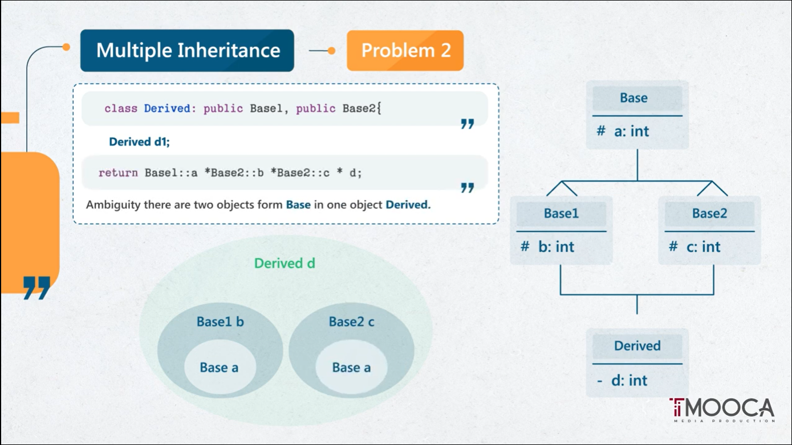
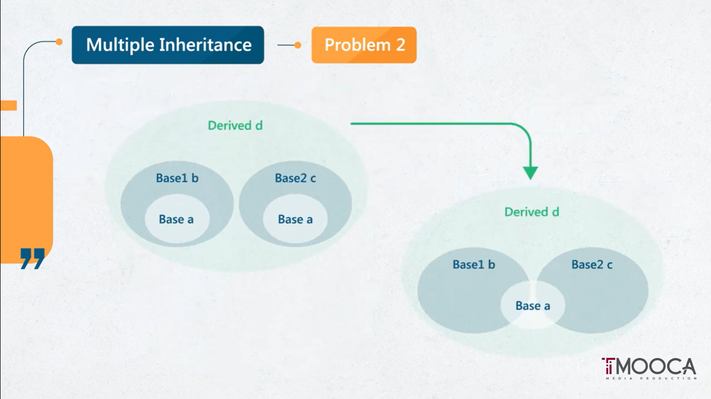
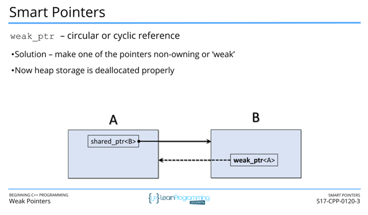
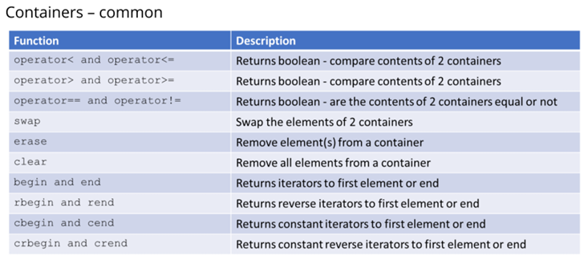
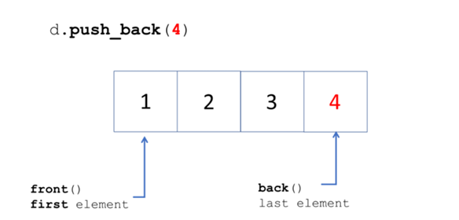
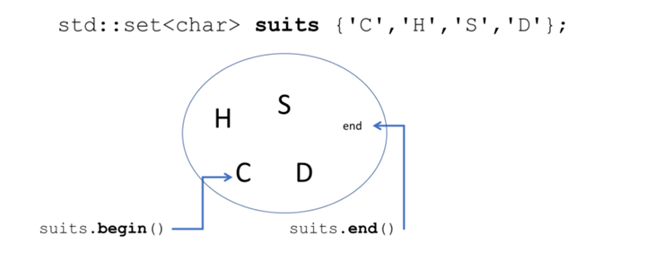
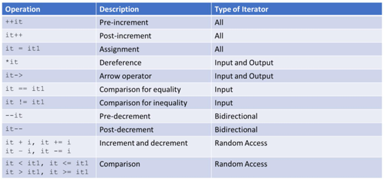

# CPP 


## 1.Class

1. **Definition**: A class is a blueprint for creating objects. It defines the properties (data members) and behaviors (member functions) of that objects of that class will have.

2. **Memory Location**: The class definition itself is typically stored in the program's code segment (also known as the **text segment**). This segment contains the executable code of the program.

3. **When It's Saved**: The class definition is compiled into the program during the compilation process. It exists in the program's code even before any objects of that class are created.

4. **Declaration:**

   ```cpp
   #include <string>
   using namespace std;
   class Person
   {
   	//attributes (Data)
       string Name;
   	int Age;
   	//Methods (functions)
   	void sound();
   	void jump();
   };
   ```

   **Declaration of a class with initialized attributes**

```cpp
using namespace std;
class Person
{
	//attributes (Data)
    string Name{"Aly"};
	int Age {24};
	//Methods (functions)
	void sound();
	void jump();
};
```


**MyClass.hpp** (Specification)

```cpp
#ifndef MYCLASS_H
#define MYCLASS_H

class MyClass 
{
private:
    int m_value;         // Data member
public:
    MyClass();           // Default constructor
    MyClass(int value);  // Parameterized constructor
    void display();      // Member function

};

#endif // MYCLASS_H

```

**MyClass.cpp** (Implementation)

```cpp
#include <iostream>
#include "MyClass.h"

// Default constructor
MyClass::MyClass() : m_value(0) 
{
    std::cout << "Default constructor called" << std::endl;
}

// Parameterized constructor
MyClass::MyClass(int value) : m_value(value) 
{
    std::cout << "Parameterized constructor called with value: " << value << std::endl;
}

// Member function
void MyClass::display() 
{
    std::cout << "Value: " << m_value << std::endl;
}

```

## 2.Objects

1. **Instance of a Class**: An object is an instance of a class. It represents a specific instance of the data and behavior defined by the class.
2. **Memory Location size**: When an object is created, memory is allocated to store its data members. The size of the memory allocated is determined by the size of the object, which depends on the size of its data members and any additional overhead **(Link)** which is used for calling the class functions.
3. **When & Where It's Saved:**
   Objects are created during runtime, typically on the stack or the heap, depending on how they are created.
4. **Stack Allocation**: If an object is created as a local variable within a function or as a function parameter, it's usually allocated on the stack. When the function goes out of scope or returns, the memory for these objects is automatically deallocated.
5. **Heap Allocation**: If an object is created using dynamic memory allocation (e.g., `new` keyword), it's allocated on the heap. The programmer is responsible for deallocating this memory using `delete` when it's no longer needed to avoid memory leaks.
6. **Data** **section**: if it is a global variable

**Special type object: Temporary objects**

```cpp
#include <iostream>

class MyClass 
{
public:
    MyClass() { std::cout << "Constructor called" << std::endl; }
    ~MyClass() { std::cout << "Destructor called" << std::endl; }
    static void show() { std::cout << "Temporary object method called" << std::endl; }
};

int main() 
{
    MyClass().show(); // MyClass() creates a temporary object used to call show()
    // Destructor called immediately after the line ends
    return 0;
}
```

**With data**

```cpp
#include <iostream>

class MyClass
{
    public:
    constexpr static int data = 0;
    MyClass()
    {
        std::cout << "Constructor called" <<std::endl;
    }
    ~MyClass()
    {
        std::cout << "destructor called" <<std::endl;
    }
    static void show()
    {
        std::cout <<"Temporary object is called with data = " << data << std::endl;
    }
};

int main ()
{
    MyClass::show();
    return 0;
}
```


## 3.Constructor

- it's a (special function = special method).

- purpose: is to initialize the newly created object.

- you can create it, if you did not compiler will and will give the constructor function the same name as the <class>.

- you do not call it, it calls itself automatically when creating an (instance = object).

- has no return type, not even void.

- can be overloaded,  meaning you can have multiple constructors with different parameter lists within the same class.

**Different method to call copy constructor in main** 

```cpp
MyClass obj1;            // Default constructor
MyClass obj2 = obj1;     // Copy constructor called for initialization
```

```cpp
int x = 5;
int y{x};  // Copy constructor called for initialization
```

### 3.1Types of Constructor

####      3.1.1 Default constructor (Zero Argument Constructor)

- A constructor that does not take from me any parameters

- Called once when creating an instance from a class

```cpp
class MyClass 
{
public:
    MyClass() // Default constructor
	{ 
        std::cout << "Default constructor called" << std::endl;
    }
};
```

```cpp
int main() 
{
    MyClass obj; // Calls the default constructor
    return 0;
}
```


####      3.1.2 Parameterized Constructor (Overloaded Constructor)

- many functions with the same name however they have different signatures-> anything after the name of the function like (Parameters, attributes).

-  this concept of similar name different signatures is called **name mangling** -> handled by compiler in different ways according to compiler used.
-  if you made a Parameterized Constructor it prevents the compiler to create the default constructor, so if you need it you must create it on your own.

```cpp
#include <iostream>

class MyClass 
{
public:
	MyClass(int value) 
	{ // Parameterized constructor
        std::cout << "Parameterized constructor called with value: " << value << std::endl;
    }
};
```

```cpp
int main() 
{
    MyClass obj2(42);   // Calls the parameterized constructor
    return 0;
}
```

####      3.1.3 Copy Constructor

- it's a (special function = special method)

-  you can create it, if you did not, compiler will, and will give the constructor function the same name as the <class>
-  you do not call it, it calls itself automatically when copying an (instance = object)   player p2=p1; -> **you should pass by reference when calling copy constructor as if you pass by value you will enter infinite recursion** 
-  **Responsible for deep copying if the class contains dynamically allocated resources.**
-  if you created multiple copies for an object of a class the first copy to be destroyed will delete the `ptr` pointing to the data of the object copied making it's location inaccessible for other parts of the program making it unreserved memory
  [Great explanation on WHY to create your own Overloaded Assignment, Copy Constructor, Destructor](https://www.youtube.com/watch?v=F-7Rpt2D-zo)

```cpp
#include <iostream>

class MyClass 
{
public:
    int* ptr;

     MyClass(const MyClass& other) // Copy constructor
	{
         ptr = new int(*other.ptr);
         std::cout << "Copy constructor called" << std::endl;
    }
};
```

```cpp
int main() 
{
    MyClass obj2 = obj1;    // Calls the copy constructor
    return 0;
}
```

####      3.1.4 Delegating Constructor

-  **I'm lazy** : if you call me, I will call another constructor to do my job

-  **it's a good practice**, you make default values for objects even if you just called in 

```cpp
#include <iostream>

class MyClass 
{
public:
    int value;

    MyClass() : MyClass(0) // Delegating to parameterized constructor
	{ 
        std::cout << "Default constructor called" << std::endl;
    }

    MyClass(int v)  // Parameterized constructor
	{ 
		value = v;
        std::cout << "Parameterized constructor called with value: " << value << std::endl;
    }
};
```

```cpp
int main() 
{
    MyClass obj1;       // Calls the default constructor
    return 0;
}
```

####      3.1.5 Move Constructor / Move semantics(C++)

- it's a (special function = special method).

- you can create it, if you did not, compiler will use copy Constructor
- used in moving ownership of the data from one object to another 
- benefits of using Moving Constructor over Copy Constructor is better memory use
- you must use the library <utility> to use the move constructor 
- you must use `std::move` keyword to use your move constructor function (look at the code)

- ​            **in case of copy constructor**  when obj2 is created by copying obj1. During this process, a temporary object is created to hold the copied data, and then obj2 is initialized using this temporary object. Finally, the temporary object is destroyed once the copy construction is complete.


- ​            **in case of move Constructor** the authority of data is transferred from one obj1 to obj2, that takes less processing time, consume less memory, overall saves resources.


```cpp
#include <iostream>
#include <utility> // For std::move

class MyClass 
{
public:
    int* ptr;

    MyClass(int value)			  		 // Parameterized constructor
	{ 
        ptr = new int(value);
        std::cout << "Parameterized constructor called" << std::endl;
    }

    MyClass(const MyClass& other)   		// Copy constructor
	{ 
        ptr = new int(*other.ptr);
        std::cout << "Copy constructor called" << std::endl;
    }

    MyClass(MyClass&& other) noexcept 		// Move constructor
	{ 
        ptr = other.ptr;
        other.ptr = nullptr;
        std::cout << "Move constructor called" << std::endl;
    }

    ~MyClass() 							//Destructor
	{
        delete ptr;
    }

    void display() 
	{
        if (ptr)
            std::cout << "Value: " << *ptr << std::endl;
        else
            std::cout << "Pointer is null" << std::endl;
    }
};
```

**`noexcept`keyword** 
Using `noexcept` with move constructors (and move assignment operators) is a best practice in modern C++ to ensure exception safety and to enable potential optimizations. It guarantees that these operations will not throw exceptions, allowing for more efficient resource management and better performance, especially when used with standard library containers.
also when using `noexcept` the move does not fail back to copy resulting in incorrect behavior 

```cpp
int main() 
{
    MyClass obj1(42);           	 // Calls the parameterized constructor
    MyClass obj2 = std::move(obj1);  // Calls the move constructor
    obj2.display();              	 // Displays value
    obj1.display();              	 // Displays "Pointer is null"
    return 0;
}
```

What happens if:

```cpp
class MyClass
{
	private:
		int x;
		int y;
		MyClass(int n, int m) : x(n), y(m) {}
}
```


## 4. Initialization list

​	**reserve empty space in memory**

```cpp
int x;
```

​	**Assignation**

```cpp
x = 5;
```

​	**reservation & assignation(Initialization) in the same line**

```cpp
int x=5; 
```

### 4.1 for Variable

#### 	4.1.1 C like Initialization 

```cpp
int x = 5;
```

#### 	4.1.2 Constructor like Initialization 

```cpp
int x (5);
```

#### 	4.1.3 Uniform Initialization

```cpp
int x {5};
```

​	**use?**
​	it check between the two types of data **(expected to send)** & **(what was actually send)** ensure no casting happens.

```cpp
int x = {5.3} //-> error -> no casting will occur
```

### 4.2 for class

#### 4.2.1 Default Member Initializers

Since **C++11**, you can initialize members directly in the class definition.

```cpp
class Person 
{
public:
    std::string name = "None";
    std::string ID = "None";

Person() 
{
    // Constructor body
}

};
```

#### 4.2.2 Member Initialization Order

##### 4.2.2.1 In order Initialization 

in the following code we **reserve & initialize** at the very beginning of the creating an **(object-instance)** of this class

```cpp
class Person 
{
    public:
        std::string ID;
        std::string name;

    Person () : ID {"None"}, name{"None"}
    {
        //implementation
    }
};
```

##### 4.2.2.2 Out of order initialization

Member variables are initialized in the order they are declared in the class, not the order they appear in the initializer list.

```cpp
class Person 
{
public:
    std::string ID;
    std::string name;

    Person() : name("None"), ID("None") { // ID is initialized before name
        // Constructor body
    }
};

```

the code above the initialization is not in order so. it will allocate and then initialize

##### 4.2.2.3 In-class Member Initializers

In-class member initializers provide default values that can be overridden by the initializer list.

```cpp
class Person 
{
public:
    std::string name = "Default Name";
    std::string ID = "Default ID";

    Person() : name("None")    // ID remains "Default ID"
	{ 
    }
};

```

##### 4.2.2.4 Delegating Constructors Initialization 

```cpp
class Person 
{
public:
    std::string name;
    std::string ID;

    Person() : Person("None", "None") // Delegating to another constructor
	{ 
		
    }

    Person(const std::string& name, const std::string& ID) : name(name), ID(ID) 
	{
        // Constructor body
    }
};

```

### 4.3 for function 

#### 	Default argument in function calls

```cpp
int sum (int x, int y, int z, int m)
{
    return x+y+z+m;
}
```

```cpp
int main()
{
    sum (1,2,3,4); 
    sum (1,2,3); //error
}
```

*solution*

```cpp
int sum (int x, int y, int z = 0, int m = 0)
{
	return x+y+z+m;
}
```

```cpp
int main()
{
    sum (1,2,3,4); 
    sum (1,2,3); // no error
	sum (1,2); // no error
    sum (1,2, ,4); // Error 
}
```

> note : you can reach the same result by using polymorphism however if you used both default arguments in function calls and polymorphism you will get a compiler error

```cpp
int sum (int x, int y=0);
int sum (int x);
```

```yaml
result
compiler error
```


## 5. Destructor 

- it's a (special function = special method)

- you can create it, if you did not compiler will and will give the destructor function the same name as the class but preceded with telda **<~class>**
- the one created by the compiler will lack the deletion of any data referenced in heap, so when you have a class that reference something in heap you have to make your own destruction function.
- you do not call it, it calls itself automatically when destroying an (instance = object).
- destruction will happen when the program gets out of the scope of the object whether it was `}` or `return 0;`
- has no return type not even void.
- can not be overload.

**Code Example**

```cpp
class MyClass 
{
    private:
        int* ptr;

    public:
        // Default constructor
        MyClass() 
        {
            std::cout << "Constructor called" << std::endl;
            ptr = new int[10]; // Dynamically allocate memory
        }

        // Destructor
        ~MyClass() 
        {
            std::cout << "Destructor called" << std::endl;
            delete[] ptr; // Clean up dynamically allocated memory
        }
};
```

we can manually call the destructor using pointer to object, but it is not recommended as it will result in undefined behavior 

```cpp
#include <iostream>

class MyClass // Ensure consistent capitalization
{
public:
    ~MyClass()
    {
        std::cout << "Destructor Called\n";
    }
};

int main()
{
    MyClass C1; // Stack-allocated object
    MyClass* c_ptr = &C1;

    c_ptr->~MyClass(); // Manually call the destructor

    // Note: Do not use C1 or c_ptr after this point, as the object is destructed
    return 0;
}

```


## 6. L-R Values

### 6.1 L-value

**What**

An L-value refers to an expression that identifies a **memory location** and can be assigned a value. L-values are typically variables or objects that have a persistent identity and can appear on the left-hand side of an assignment operation, They represent persistent values that can be modified or accessed.

**so we are basically talking about an address here**

**Why**

L-values are commonly used when assigning values to variables or objects, modifying the state of objects, or **passing arguments to functions that expect references.**

**Example**

1. **Variables**

```cpp
int a = 10; 
a = 20; 
```

2. **Objects**

```cpp
class MyClass 
{
    public:
        int value;
        MyClass(int v) : value(v) {}
};

int main() 
{
    MyClass obj(10); // 'obj' is an L-value
    obj.value = 20; // 'obj.value' can appear on the left-hand side of an assignment
    std::cout << "Object value: " << obj.value << std::endl; // Output: 20
    return 0;
}

```

3. **Array Elements**

```cpp
int arr[5] = {1, 2, 3, 4, 5}; // 'arr[i]' are L-values

arr[2] = 10; // 'arr[2]' can appear on the left-hand side of an assignment

```

4. **Dereferenced Pointers**

```cpp
int x = 10; // 'x' is an L-value
int *p = &x; // 'p' is a pointer to 'x' 'p' L-Value
*p = 20; // '*p' (dereferenced pointer) is an L-value

```

5. **References**

```cpp
int y = 30; // 'y' is an L-value
int &ref = y; // 'ref' is a reference to 'y' (L-value reference)
ref = 40; // 'ref' can appear on the left-hand side of an assignment
```

**L-Value refrence**

An L-value reference in C++ is a reference that binds to an L-value. It allows you to refer to a variable or object by another name, effectively aliasing it. L-value references are declared using the ampersand (`&`) symbol.

```cpp
int a = 10; // 'a' is an L-value
int &ref = a; // 'ref' is an L-value reference to 'a'

```

### 6.2 R-value

- **What**

R-value refers to an expression that represents a temporary or transient value, it's of course on the Right hand sign of the operation or term.

- **Example**

**1- Literals (such as numbers or strings)**

```cpp
int x = 100; // 100 is an R-value literal
```

```cpp
std::string str = "Hello, World!"; // "Hello, World" R-value literal
```

**2-temporary objects**

```cpp
#include <iostream>

class MyClass 
{
public:
    MyClass() { std::cout << "Constructor called" << std::endl; }
    ~MyClass() { std::cout << "Destructor called" << std::endl; }
    void show() { std::cout << "Temporary object method called" << std::endl; }
};

int main() 
{
    MyClass().show(); // MyClass() creates a temporary object used to call show()
    // Destructor called immediately after the line ends
    return 0;
}

```

**3- the result of expressions**

```cpp
int a = 10, b = 20;
int sum = a + b;	 // 'a + b' results in an R-value used to initialize sum
```

**4- Return Value of Functions**

```cpp
#include <iostream>

class MyClass 
{
public:
    MyClass() { std::cout << "Constructor called" << std::endl; }
    ~MyClass() { std::cout << "Destructor called" << std::endl; }
};

MyClass createObject() 
{
    return MyClass(); // Returns a temporary MyClass object
}

int main() 
{
    MyClass obj = createObject(); // The return value of createObject() is an R-value
    // Destructor called when obj goes out of scope
    return 0;
}

```

- **Lifetime of R-value refrence**:
  An R-value typically exists for the duration of the expression in which it appears. Once that expression is evaluated, the temporary R-value is destroyed. For example:

```cpp
int x = 100 + 200; // 100 + 200 is an R-value expression.
```

Here, `100 + 200` is an R-value expression that exists temporarily to initialize `x`. After `x` is initialized, the R-value `100 + 200` ceases to exist.

- **Where in memory is the R-Value **

in text code segment, in runtime it gets transferred to register and if there is an operation the result r-value is saved in a register and the result will cease to exist after the operation is done

- **R-value Refrence**

While R-Values are a temporary but you can extend there lifetime, by making an R-value refrence.
the lifetime starts at the initialization and ends at the end of scope of the variable  

```cpp
int &&x=200;  //valid, as we extend it's life time untill the scope of x ends and created a refrence out of it so i can access it
cout<<x<<endl; //200
{
int &&Ref = 3;
Ref = 43;    
}
```

**Sum up Example**

![[L-R]Values](Cache/[L-R]Values.png)

## 7. Constant Object 

**What**

it's a type qualifier to be assigned to a Object

**Why**

I have important data that I do **not** want it change across time of the program

**How**

```cpp
const Person p1 ( "Aly" , "1234" );

void Person::display_info(void) const
{
    std::cout <<"The name is :"<< name << std::endl;
    std::cout <<"The ID is :" << ID << std::endl;
    // the function is constant so i can not change any of the data of the class 
    // name = "Ahmed";
}
```


## 8. Constant function

**What**

it's a type qualifier to be assigned to a function 
It promises not to modify the state of the object on which it is called.
Constant member functions can be called on constant objects, as well as on non-constant objects.

**Why**

in read function to ensure that no function to be called can change any data

**How**

```cpp
class MyClass
{
public:
    void display_info(void) const 
	{
          std::cout <<"The name is :"<< name << std::endl; 
   		  std::cout <<"The ID is :" << ID << std::endl;
		   // the function is constant so i can not change any of the data of the class 
    }
};
```


## 9. Static variable 

**What**

It's a variable that is shared among the whole class and all of it's objects

**Why**

Global data across all the class

**How**

```cpp
class Person
{
    public:
        static int counts;         //declaration
};

int Person::counts =0;            //Initilization 

int main()
{
    Player p1;
    Player p2;
    std::cout<<"the value of the static variable that is shared among the whole class and all of it's objects is: "<<Person::counts<<endl;
    p1.counts = 5;
    std::cout<<"the value of the static variable that is shared among the whole class and all of it's objects is: "<<Person::counts<<endl;
    p2.counts++;
    std::cout<<"the value of the static variable that is shared among the whole class and all of it's objects is: "<<Person::counts<<endl;

	Person::counts; // this is the recomended way 
                                    //Printing out the value of 
}
```


## 10. Static Function 

**What?**

-It's a functions that is shared among the whole class and all of it's objects and can access the static private data
Static functions can be called using the class name, without needing to create an object of the class.

-does not have **this** pointer.

**Why?**

They are typically used for utility functions or operations that do not require access to the non-static members of the class.

normally you won't be able to access private data WHY? because it does not have this pointer

however to be able to access private data 
-> you can make it static variable.
-> you can access it through Static function.

**How?** (try to run this code and see the results)

```cpp
#include <iostream>

class MyClass 
{
    private:
        static int count; // Static data member

    public:
        // Static function to increment the count
        static void incrementCount() 
		{
            count++; // Accessing and modifying the static data member
        }
    
    	static void set_increment(const int& new_count)
        {
            count = new_count;
        }

        // Static function to get the current count
        static int getCount() 
		{
            return count; // Accessing the static data member
        }
};

// Initializing static data member outside the class definition
int MyClass::count = 0;

int main() 
{
    std::cout << "Initial count: " << MyClass::getCount() << std::endl;

    // Call the static function to increment the count
    MyClass::incrementCount();
    std::cout << "Count after increment: " << MyClass::getCount() << std::endl;

    // Call the static function to increment the count again
    MyClass::incrementCount();
    std::cout << "Count after second increment: " << MyClass::getCount() << std::endl;

    return 0;
}
```

**why use lvalue refrence when setting the count?**


| Parameter Type          | Accepts Lvalue | Accepts Rvalue | Copies Made | Notes                              |
| ----------------------- | -------------- | -------------- | ----------- | ---------------------------------- |
| `string`                | ✅              | ✅              | ✅           | Always makes a copy                |
| `const string&`         | ✅              | ✅              | ❌           | Best for read-only input           |
| `string&&` (rvalue ref) | ❌              | ✅              | ❌ (move)    | Use only if you need to steal data |
| `string&`               | ✅              | ❌              | ❌           | Only for mutable lvalues           |


## 11. this  pointer

**What**

it's a pointer that points to the data of the class, and of the class only

**why**

it's the normal way to access your class data if you did not do it compiler will do it for you
it helps differentiate between local variables and class data

**How**

```cpp
Person(std::string name, std::string ID) 
{ 
    this->name = name;
    this->ID = ID;
    std::cout<<"Constructor2 has been called"<<std::endl;
};

```


## 12. friend function/Class

**What**

A friend function in C++ is a function is not a member of a class.
Friend functions are declared inside a class and preceded by the `friend` keyword, and must be implemented outside of the class, They can access **private** and **protected** members of the class as if they were regular member functions.

**Why**

Friend functions are useful in situations where a function needs to access private or protected members of a class, but it is not appropriate or possible to make that function a member of the class. Some common use cases for friend functions include:

1. **Accessing Private Data**: When a function needs to access private data members of a class to perform a specific operation.
2. **Non-member Function**: When a function logically belongs outside the class but still needs access to its private or protected members.
3. **Overloading Operators**: When overloading certain operators (such as `<<` or `>>`), friend functions are often used to allow the operator to access private members of a class.

**How to declare, implement, and use friend functions:** (try to run this code)

```C++
#include <iostream>

class MyClass 
{
private:
    int data;

public:
    MyClass(int d) : data(d) {}

    // Declare friend function inside the class
    friend void friendFunction(MyClass obj);
};

// Implement the friend function outside the class
void friendFunction(MyClass obj)     // Friend function can access private members of MyClass
{
    std::cout << "Friend function accessed private data: " << obj.data << std::endl;
}

int main() 
{
    MyClass obj(10);
    // Call the friend function
    friendFunction(obj);
    return 0;
}
```

> Note: there is something called friend class 

```cpp
#include <iostream>

class B; // Forward declaration

class A 
{
private:
    int secret;

public:
    A() : secret(42) {} // Constructor initializes secret

    friend class B; // Declaring B as a friend class
};

class B {
public:
    void revealSecret(const A& a) {
        std::cout << "Secret from class A: " << a.secret << std::endl;
    }
};

int main() {
    A a;
    B b;
    b.revealSecret(a); // Accessing private member of A
    return 0;
}
```


## 13. operator overloading

**What**

-  Using traditional operators with user-defined data types.

-  Allow user-defined data types to behave similarly to built-in types.
- ‍‍‍‍Can make code more readable and writable.
- Not done automatically (except for the assignment operator).
- They must be explicitly defined.

**Why**

- Suppose that we have a Number class that models any number

  **Using function**

  ```cpp
  Number result = multiply(divide(a,b),divide(c,d));
  ```

   **Using operator overloading**

  ```cpp
  Number result = (a/b) * (c/d);
  ```

**Constraints:**

1. Precedence and Associativity can not be changed
2. Polarity can not be changed
3. Can not create new operators
4. Can not overload operators to use with primitive types

The following Operators can not be overloaded

```cpp
::						//Scope resolution
?:						//Conditional Operator (ternary)
.*						//Pointer to Member Operator
. 						//Dot Operator
sizeof					//Size of Operator
```

**How in the past**

```cpp
class Company
{
    Private:

         int salaries;

     Public:

         Multiply (int Mul)
         {
             salaries*=Mul;
         }
         Divide (int dev)
         {
             salaries /= dev;
         }

};

int main 
{
    Company employee1;

    employee1.Multiple(10);
    employee1.Divide(10);

}
```


### 13.1 Operator overloading types

#### 13.1.1 Copy assignment operator

**Why?**

- the compiler by default creates a Copy assignment operator the problem with this default copy assignment operator is that it makes a shallow copy (member wise copy) operation 


- if you want to make a deep copy version of it you have to implement one yourself 


- [Great explanation on WHY to create your own Overloaded Assignment, Copy Constructor, Destructor](https://www.youtube.com/watch?v=F-7Rpt2D-zo)

- When to write your own ( Overload assignment operator, copy constructor, destructor )?

whenever we have a class that has members that can reference heap space.

**Example**

```cpp
#include <iostream>
#include <cstring>

class MyString 
{
private:
    char* str;
public:
    MyString(const char* s = nullptr) 
	{
        if (s) 
		{
            str = new char[strlen(s) + 1];
            strcpy(str, s);
         } 
		else 
		{
            str = nullptr;
         }
    }

    ~MyString() 
	{
        delete[] str;
    }

    // Copy assignment operator
	void operator=(const MyString& src) 
	{
        if (this != &src) // to avoid self-assignment
		{ 
            delete[] str;//deallocation of memory potentially previously allocated when creating the calling object

            if (src.str != nullptr) // check if src.str is not null
            { 
                str = new char[strlen(src.str) + 1];
                strcpy(str, src.str);
             } 
            else 
            {
                str = nullptr;
            }
        }
    }

    // For demonstration purposes
    void print() const 
	{
        if (str) 
		{
            std::cout << str << std::endl;
         } 
		else 
		{
            std::cout << "null" << std::endl;
         }
    }
};

int main()
{
    MyString s1("Hello");
    MyString s2("World");
    s2 = s1; // Use copy assignment operator
    s2.print(); // Output: Hello
    return 0;
}

```

**What would happen if I just implemented like this?**

```cpp
void operator= (const Mystring &src)
{
    //to avoid self copy    
    if (this != &src)    
    {        
        strcpy(str,src.str);    
    }    
    return *this;               
}
```


according to my understanding, the **RHS** object data will overwrite the **LHS** object data meaning i would be able to do copy assignment no problem ? am i right? 

Here's what would happen:

1. **No Memory Allocation Check**:
   - Your implementation assumes that memory has already been allocated for `str` in the current object. However, if `str` has not been allocated or if it's a dangling pointer (pointing to invalid memory), using `strcpy` will result in undefined behavior, potentially leading to crashes or data corruption.
   
2. **No Memory Allocation for `str`**:
   - If the `str` member of the current object (`*this`) has not been allocated memory yet, using `strcpy` will attempt to copy data to an uninitialized or invalid memory location, resulting in undefined behavior.
   
3. **Memory Overwrite Risk**:

   - If `str` has been previously allocated and contains some data, your implementation will indeed copy the contents of `src.str` to `str`. However, this will lead to the previous data being overwritten by the data from `src.str`. This may be acceptable if you are sure that the memory allocated for `str` is large enough to accommodate the data from `src.str`. Otherwise, it will lead to buffer overflow, causing undefined behavior.

4. **No Memory Allocation for `str` in `src`**:
- Your implementation assumes that memory has been allocated for the `str` member in the `src` object. If `src.str` is an uninitialized or null pointer, using `strcpy` will result in undefined behavior.

 **implementation in main** 

```cpp
int main
{
	P1=P2  // p1.operator=();
}
```

while the above piece of code is technically correct but it is not used and it violates the conventions 
a better way to implement Operator overloading is:

```cpp
Mystring& operator=(const MyString& src) 
{
    if (this != &src) // to avoid self-assignment
    { 
        delete[] str; // delete old string

        if (src.str != nullptr) // check if src.str is not null
        { 
            str = new char[strlen(src.str) + 1];
            strcpy(str, src.str);
         } 
        else 
        {
            str = nullptr;
        }
        return this;
    }
}
```

this code follows the standard and enables the **chaining**

```cpp
int main 
{
	S1=S2=S3=S4  
}
```

**why did we use constant?**
ask yourself in this situation when you are S2 = S1 for example, do you want the value of S1 to be changed by this operation, the answer should be no so you use constant to make sure that the value will not be changed.

#### 13.1.2 move assignment operation

- it's a (special function = special method).
- you can create it, if you did not, compiler will use copy assignment
- you do not call it, it calls itself automatically when giving a temp (instance = object).
- used in moving ownership of the data from one object to another 
- benefits of using Moving assignment over Copy assignment is better memory use 

​            **in case of copy assignment **  when obj2 is created by copying obj1. During this process, a temporary object is created to hold the copied data, and then obj2 is initialized using this temporary object. Finally, the temporary object is destroyed once the copy construction is complete.

​            **in case of move assignment ** the authority of data is transferred from one obj1 to obj2, that takes less processing time, consume less memory, overall saves resources.

```cpp
Mystring & operator= (Mystring &&src)
{
    //to avoid self movement 
    if (this != &src)
    {
        delete []str;   //deallocation of memory potentially previously allocated when creating the calling object
		if (src.ptr != nullptr)
        {
            str = src.str; // assign data from source to the object calling this method
            src.str = nullptr; // deleting the pointer of the src object as it won't be needed again and other pointer will have the authority over this data
        }
    }
}

```

**How to use move assignment operator in main** 

1. **Pass R-value**

```cpp
int main ()
{
    I1 = string{"ahmed"};       
    I2 = {"omar"};
//behind the scene the compiler will construct a temp object that will moved in I1/I2 and then it will be destructed and we are still passing r-values that is why we get move assignmnet
}
```

2. **Pass L-value and cast it to R-Value**

```cpp
int main ()
{
	I2 = std::move(I1);
}
```

`std::move` is used to cast an object to an **r-value reference**, enabling move semantics instead of copy semantics. This is useful for **performance optimization** by avoiding deep copies when moving resources.

**what is the difference between `delete pointer` and `pointer = nullptr`;?**

In C++, `delete pointer;` is used to deallocate the memory pointed to by `pointer` and destroy the object it points to if it's dynamically allocated. After `delete pointer;` is executed, the memory previously pointed to by `pointer` is released back to the system for reuse. However, `pointer` itself still holds the address of the deallocated memory, and accessing it can lead to undefined behavior.

On the other hand, `pointer = nullptr;` simply assigns the null pointer value to `pointer`. It doesn't deallocate any memory. This is useful for indicating that `pointer` is no longer pointing to a valid memory location, helping prevent accidental access to deallocated memory.

So, to safely release memory and ensure that `pointer` no longer points to deallocated memory, you typically use both statements together:

#### 13.1.3 Arithmetic operator

##### 13.1.3.1 Unary Operator (++ , --, -, !)

**Constraints:** 
you can not overload it into binary operator

**1. Operation overloading for(+)**

```cpp
Mystring operator+ ()
{
    char *buffer = new char [std::strlen(str)+1];
    std::strcpy(buffer,str);
    int len = strlen(str);
    for (size_t i=0 ; i<len ; i++ )
    {
        buffer[i] = std::toupper(str[i]);
    }
    Mystring temp = Mystring(buffer);
    delete[] buffer;
    return temp;
}
```

note: *size_t* is just an *unsigned int* which guarantees to be bigger than *unsigned int* making it more suitable and we are not gonna act in **-ve** anyway.

```cpp
int main ()
{
	Mystring Larry1 {"larry"};
    Mystring Larry2;
    
	Larry2 = +Larry1;  //Larry1.operator+();
    
    Larry1.display();
    Larry2.display();

	return 0;
}
```

*output*

```yaml
larry
LARRY
```

**2. Operation overloading for (-)**

```cpp
Mystring operator- ()
{
    char *buffer = new char [std::strlen(str)+1];
    std::strcpy(buffer,str);
    for (size_t i=0 ; i<strlen(str) ; i++ )
    {
        buffer[i] = std::tolower(str[i]);
    }
    Mystring temp = Mystring(buffer);
    delete[] buffer;
    return temp;
}
```

```cpp
int main ()
{
	Mystring Larry1 {"LARRY"};
    Mystring Larry2;
    
	Larry2 = -Larry1;
    
    Larry1.display();
    Larry2.display();

	return 0;
}
```

*output*

```yaml
LARRY
larry
```

**3. Operation overloading for (++)**

**3.1 Pre increment ** : will repeat the first half of the string 

```cpp
Mystring operator++ ()
{
	int len = strlen(str);
	int new_len = len + len/2;
	char* buffer = new char [new_len + 1];

	for (size_t i =0; i< len/2 ; i++)
    {
        buffer[i] = str[i];
    }
	for (size_t i=0 ; i<len ; i++)
    {
        buffer[i+len/2] = str[i];
    }

	buffer[new_len] = '\0';
	Mystring temp {buffer}; // must be deep copy

    delete[] buffer;
	return temp;
}
```

**3.2 Post increment** : will repeat the 2nd half of the string

```cpp
MyString operator++ (int)
{
    int len = strlen(str);
    int new_len = len + len/2;
    char* buffer = new char [new_len + 1];

    for (size_t i=0 ; i<len ; i++)
    {
        buffer[i] = str[i];
    }
    for (size_t i =len/2; i< len ; i++)
    {
        buffer[i+len/2] = str[i];
    }

    buffer[new_len] = '\0';
    MyString temp {buffer}; // must be deep copy

    delete[] buffer;
    return temp;
}
```

**4 Operator overloading for (--)**

**4.1 Pre decrement** : will remove the 1st half of the string 

```cpp
MyString MyString::operator-- ()
{
    int len = strlen(str);
    int new_len = len/2;
    char* buffer = new char [new_len];

    for (size_t i=0; i<new_len; i++)
    { 
        buffer[i] = str[i];
    }

    buffer[new_len] = '\0';

    MyString temp = buffer;
    delete[] buffer;

    return temp;
}
```

**4.2 Post decrement:** will remove the 2nd half of the string

```cpp
MyString MyString::operator-- (int)
{
    int len = strlen(str);
    int new_len = len/2;
    char* buffer = new char [len];

    for (size_t i=new_len; i<len; i++)
    {
        buffer[i-new_len] = str[i];
    }
    buffer[new_len] = '\0';

    MyString temp = buffer;
    delete[] buffer;

    return temp;
}
```


##### 13.1.3.2 Binary

**Operation overloading for (+)**

```cpp
MyString MyString::operator+(const MyString& rhs)
{
    int FH_len = strlen(str);
    int new_len = strlen(str) + strlen(rhs.str);
    char* buffer = new char [new_len + 1];
    
    for (size_t i = 0; i<FH_len; i++)   // First half copying
    {
        buffer[i] = str[i];
    }
    for (size_t i = 0; i<new_len; i++)
    {
        buffer[i+FH_len] = rhs.str[i];
    }
    buffer[new_len] = '\0';

    MyString temp {buffer};
    delete [] buffer;

    return temp;
}
```


## 14. Concepts of OOP 

### 14.1  Abstraction

#### Types of Abstraction: 

##### 1-Data abstraction:

This type only shows the required information about the data and  hides the unnecessary data. 

##### 2-Control Abstraction: 

This type only shows the required information about the  implementation and hides unnecessary information.

#### how to abstract

##### 1-Abstraction using Classes

We can implement Abstraction in C++ using classes. a Class can decide which data member will be visible to the outside world and which is not. 

##### 2-Abstraction in Header files

abstraction in C++ can be header files. 

##### 3-Abstraction using Access Specifiers-Access

specifiers are the main pillar of implementing abstraction in  C++.
-We can use access specifiers to enforce restrictions on class  members.

**Code Example**

```cpp
#include <iostream>

// Abstract base class
class AbstractDevice 
{
    public:
        virtual void start() = 0; // Pure virtual function
        virtual void stop() = 0;  // Pure virtual function
};
```

```cpp
class Printer : public AbstractDevice 
{
public:
    void start() override 
	{
        std::cout << "Printer starting..." << std::endl;
    }

    void stop() override 
	{
        std::cout << "Printer stopping..." << std::endl;
    }
};

```

```cpp
class Scanner : public AbstractDevice 
{
public:
    void start() override 
	{
        std::cout << "Scanner starting..." << std::endl;
    }

    void stop() override 
	{
        std::cout << "Scanner stopping..." << std::endl;
    }
};
```

```cpp
void operateDevice(AbstractDevice& device) 
{
    device.start();
    // Perform operations...
    device.stop();
}

int main() 
{
    Printer printer;
    Scanner scanner;

     operateDevice(printer); // Outputs: Printer starting... Printer stopping...
     operateDevice(scanner); // Outputs: Scanner starting... Scanner stopping...

     return 0;
}
```


### 14.2 Encapsulation

**Explanation** 
Encapsulation is the bundling of data and methods that operate on that data into a single unit, typically a class. Encapsulation serves two purposes: grouping related data and methods together, and controlling access to the data through public methods. It ensures that an object's internal state can only be changed in a controlled manner.

**Visualization** 


**Code Example**

```cpp
class BankAccount 
{
private:
    double balance;  // Encapsulated data

public:
    BankAccount(double initial_balance) : balance(initial_balance) {}

    // Encapsulated methods to manipulate the data
    void deposit(double amount) 
	{
        if (amount > 0) 
		{
            balance += amount;
         }
     }

    void withdraw(double amount) 
	{
        if (amount > 0 && amount <= balance) 
		{
            balance -= amount;
         }
     }

    double getBalance() const 
	{
        return balance;
     }
};

```


### 14.3 Data hiding

**Explanation** 

Data hiding is a principle in object-oriented programming (OOP) that restricts direct access to some of an object's data and internal workings. The main idea is to protect the integrity of the data by preventing unintended or unauthorized access and modification. This is typically achieved through access modifiers like `private` and `protected` in C++.

**Visualization** 
                                           

**Code Example**

```cpp
class BankAccount 
{
private:
    double balance;  // Hidden from outside access

public:
    BankAccount(double initial_balance) : balance(initial_balance) {}

    // Public methods to interact with the hidden data
    void deposit(double amount) 
	{
        if (amount > 0) 
		{
            balance += amount;
        }
    }

    void withdraw(double amount) 
	{
        if (amount > 0 && amount <= balance) 
		{
            balance -= amount;
        }
     }

    double getBalance() const 
	{
        return balance;
     }
};

```

### 14.4 association

Association is a relationship among classes which is used to show that instances of classes could be either linked to each other or combined logically or physically into some **aggregation**

**association relations** 

1. **one to one**

   One instance of a class is associated with one instance of another class
   **Example: Person and Passport**
   Person object can only refer to one passport object

   

   **Code:**

   ```cpp
   class Passport 
   {
   public:
       std::string passportNumber;
       Passport(const std::string& number) : passportNumber(number) {}
       void display() const 
       {
           std::cout << "Passport Number: " << passportNumber << std::endl;
       }
   };
   ```

   ```cpp
   class Person 
   {
   public:
       std::string name;
       Passport* passport; // One-to-one association
       Person(const std::string& n, Passport* p) : name(n), passport(p) {}
       void display() const 
   	{
           std::cout << "Name: " << name << std::endl;
           passport->display();
       }
   };
   ```

   ```cpp
   int main()
   {
       Passport passport("123456789");
       Person person("John Doe", &passport);
       person.display();
       return 0;
   }
   ```

2. **one to many**

   One instance of a class is associated with multiple instances of another class
   **Example: Teacher and Students**
   Teacher has many references to students

   

   Code:

   ```cpp
   class Student 
   {
   public:
       std::string name;
       Student(const std::string& n) : name(n) {}
       void display() const 
   	{
           std::cout << "Student Name: " << name << std::endl;
       }
   };
   ```

   ```cpp
   class Teacher 
   {
   public:
       std::string name;
       std::vector<Student*> students; // One-to-many association
       Teacher(const std::string& n) : name(n) {}
       void addStudent(Student* student) 
   	{
           students.push_back(student);
       }
       void display() const 
   	{
           std::cout << "Teacher Name: " << name << std::endl;
           for (const auto& student : students) 
   		{
               student->display();
       	}
       }
   };
   
   ```

   ```cpp
   int main() 
   {
       Student student1("Alice");
       Student student2("Bob");
       Teacher teacher("Mr. Smith");
       teacher.addStudent(&student1);
       teacher.addStudent(&student2);
       teacher.display();
       return 0;
   }
   ```

3. **many to one**

   Multiple instances of a class are associated with one instance of another class
   **Example: Employees and Department**

   Many employees may only refer to one Department
   						

   ```cpp
   class Department 
   {
   public:
       std::string name;
       Department(const std::string& n) : name(n) {}
       void display() const 
   	{
           std::cout << "Department: " << name << std::endl;
       }
   };
   ```

   ```cpp
   class Employee 
   {
   public:
       std::string name;
       Department* department; // Many-to-one association
       Employee(const std::string& n, Department* d) : name(n), department(d) {}
       void display() const 
   	{
           std::cout << "Employee Name: " << name << std::endl;
           department->display();
       }
   };
   ```

   ```cpp
   int main() 
   {
       Department dept("HR");
       Employee employee1("Alice", &dept);
       Employee employee2("Bob", &dept);
       employee1.display();
       employee2.display();
       return 0;
   }
   ```

4. **many to many**

   Multiple instances of a class are associated with multiple instances of another class
   **Example: Students and Courses** 
   student may register to multiple courses,
   course may be registered by multiple students

```cpp
class Course;
```

```cpp
class Student 
{
public:
    std::string name;
    std::vector<Course*> courses; // Many-to-many association
    Student(const std::string& n) : name(n) {}
    void addCourse(Course* course) 
	{
        courses.push_back(course);
    }
    void display() const 
	{
        std::cout << "Student Name: " << name << std::endl;
        for (const auto& course : courses) 
		{
            std::cout << "  Enrolled in: " << course->name << std::endl;
        }
    }
};
```

```cpp
class Course 
{
public:
    std::string name;
    std::vector<Student*> students; // Many-to-many association
    Course(const std::string& n) : name(n) {}
    void addStudent(Student* student) 
	{
        students.push_back(student);
    }
    void display() const 
	{
        std::cout << "Course: " << name << std::endl;
        for (const auto& student : students) 
		{
            std::cout << "  Student: " << student->name << std::endl;
        }
    }
};
```

```cpp
int main() 
{
    Student student1("Alice");
    Student student2("Bob");

    Course course1("Math");
    Course course2("Science");

    student1.addCourse(&course1);
    student1.addCourse(&course2);
    student2.addCourse(&course1);

    course1.addStudent(&student1);
    course1.addStudent(&student2);
    course2.addStudent(&student1);

    student1.display();
    student2.display();
    course1.display();
    course2.display();

    return 0;
}
```

**association types**

**Weak Association (Aggregation):** 

- It is a specialized form of association between two or more objects in which the objects have their own life-cycle but there exists an ownership as well. As an example, an employee may belong to multiple departments in the organization. However, if the department(the container) is deleted, the employee(the contained) object won't.
- all of the previous examples were aggregation type
- It represents **has-a** relationship

**Strong Association (Composition):** 

- Composition is a specialized form of association in which if the container object is destroyed, the included objects would cease to exist. It is actually a strong type of association and is also referred to as a "death" relationship. As an example, a house is composed of one or more rooms. If the house is destroyed, all the rooms that are part of the house are also destroyed as they cannot exist by themselves.
- It represents **part-of** relationship
- Embedded object is a form of strong association

  - Code Example 

    ```cpp
    class Point
    {  
    private:
    	int x ;
    	int y ;
    public:
    	Point() : x(0),y(0) {}
        Point(int m) 
    	{
    	x = y = m ;
        cout<<“Point default constructor is calling”<<endl;
    	}
        point (int m, int n)
        {
            x= m;
            y= n;
        }
        setXY (int m, int n)
        {
            x = m;
            y = n;
    	}
    }
    ```
    
    ```cpp
    class Line
    {  
    private:
        Point start;  //Embedded object.
        Point end;	  //Embedded object.
    public:
        Line() 
        {
            start.setXY(0,0);
            end.setXY(0,0);
            cout<<“Line default constructor is calling”<<endl;
        }
    
    ```
    
    **Constructor and destructor chaining in case of embedded objects (Interview Question).**
    for the same example above
    
    ```cpp
    int main()
    {
    	Line myline;
    	return 0;
    }
    ```
    
    the **constructor channing** when executing `Line myline;`
    
    ```ABAP
    point constructor called
    point constructor called
    line constructor called
    ```
    
    the **destructor channing** when the main code is done executing 
    
    ```ABAP
    line destructor called
    point destructor called
    point destructor called
    ```

**which point constructor will be called when executing `Line myline;`? (interview question)**

the default constructor 

**can I change what constructor to be called?**

Yes, you can change the constructor to be called 
example

```cpp
Line(int x1, int y1, int x2, int y2) : start(x1, y1) , end(x2, y2)
 {}
```

### 14.5 Inheritance

#### 14.5.1 types of inheritance


**What?**

the ability to derive a new class from existing class with attributes & methods with the ability to extend or modify the (attributes, methods).
It's a method to create a class from an existing class with properties and characteristics and it gives me the ability to extend and modify.

**You can refer/case to the derived class with it's parent** 

```cpp
Derived(const Derived &source) : Base(source)
{
    this->y = source.y;
    cout << "Copy Constructor of the Derived class" << endl;
}
```

the **base class** has some info and the **derived class** has some more additional info to it and when you access an object of derived class through the base class you are accessing the data that is within the base class only.

derived class **is-a** base class

**Terminology** 

**1-Base Class - Parent class - Superclass:**
class from which we inherit another class.

**2-Derived class - child class - Subclass** 
class that inherits from the Base class 

**Why**?

C++ is based on real life, so it's a logical real life approach to programming

**How**?

```cpp
class A
{
    private:
        int x; 
    public:
        void display();
};

class B : public A
{
private:
    int y;
public:
    display_y();
};
```

**how is that mapped in the memory?**
**data** of Class parents exist in memory whenever you create an instance of the class + whenever you create an instance of a child class from that parent 

**function** when creating multiple instances of a class functions are not created multiple times however, they are created once and then the functions have a pointer pointing to it 

**Access modifiers:**
the default access modifier is **private**


> **note** function signature is the combination of (**function return type** "debatable" , **function name**, **parameters type**,  **parameters order**)  similar to function prototype, or API

#### 14.5.2 Multiple Inheritance


While it is not a concept that is used in C++ frequently but it can be used 

**Example:**

```cpp
class Derived : public Base1, public Base2
{
    private:
    	int c;
    public:
    	Derived (int x=0, int y=0, int z=0) : Base1(x), Base2(y) , c(z)
        {}
    
    	int product()
        { return a*b*c; }
    
}
```

It's recommended to have the same Inheritance Mode for both classes

*the constructor* seqence  

```yaml
Base class 1
Base class 2
Derived class
```

*the destructor sequence*

```
Derived class
Base class 2
Base class 1
```


##### Problems with multiple inheritance

###### 1- Common name resolution

```cpp
class Base1
{
	protected:
		int a;
}
```

```cpp
class Base2
{
	protected:
		int a;
}
```

```cpp
class Derived : public Base1 , public Base2
{
	public:
    	int c;
    
    int product()
    {
        return a*a*c
    }
    
}
```

*output*

```
"Derived::a" is ambiguous
```

Ambiguity error the complier will not be able to deduce which **a** you choose it to be

*solution* 

```cpp
class Derived
{
	public:
		int c
		
	int product()
	{
		return Base1::a * Base2::a * c;
	}
}
```

###### 2-Diamond problem

looking at the picture above you will notice that the derived class inheritance from Base1 and Base2 and these classes originally inherit from class Base which means that in the Derived class now 4 class (Base1, Base2, Base, Base) this is a problems as Base is in this class twice because it is common in Base1 and Base2

```cpp
class Base
{
	public:
		Base()
		{
			cout<<"Base Constructor" << endl;
		}
}
```

```cpp
class Base1 : public Base
{
	protected:
		int a;
    
	public:
		Base1()
		{
			cout<<"Base1 Constructor" << endl;
		}
}
```

```cpp
class Base2 : public Base
{
	protected:
		int b;
    
	public:
		Base2()
		{
			cout<<"Base2 Constructor" << endl;
		}
}
```

```cpp
class Derived : public Base1 , public Base2
{
	public:
    	int c;
    
    int product()
    {
        return a*b*c;
    }
    

	Derived()
	{
		cout<<"Derived Constructor" << endl;
	}
    
}
```

```cpp
Base Constructor
Base1 Constructor
Base Constructor
Base2 Constructor
Derived Constructor
```


*solution* 



***Virtual*** keyword

```cpp
class Base
{
	protected: 
		int a;
}
```

```cpp
class Base1  : virtual public Base
{
	protected:
		int b;
}
```

```cpp
class Base2 : virtual public Base
{
	protected:
		int c;
}
```

```cpp
class Derived : public Base1 , public Base2
{
	public:
    	int c;
    
    int product()
    {
        return a*a*c
    }
    
}
```

```yaml
Base Constructor
Base1 Constructor
Base2 Constructor
```

Virtual keyword ensures that the class when constructed must search if the base of it exists in that domain or not.

**Question**:
why not make the two class inherit virtually, I can just choose Base2 to be virtual, meaning only Base2 will check is the Base class check in that domain before constructing it.

while this way could work fine, but you put yourself at a RISK of changing the constructor order so for example in this code 

```cpp
class Derived : public Base1 , public Base2
{
        public:
            int c;
    int product()
    {
        return a*a*c
    }
}
```

it will create Base1 and then in Base2 it will check if Base exists in or not and finally it will create derived object
which will lead to a working efficient code.

but if the code was

```
class Derived : public Base2 , public Base1
{
        public:
            int c;
    int product()
    {
        return a*a*c
    }
}
```

it will create Base2 and will check if there is any Base object exists in that domain so it will create a Base object, and then it will create Base1 object which will not check Base class object, so it will make another one, making the code not efficient 

***Conc.***

Make both classes that inherited from the same class virtual.

### 14.6 Polymorphism 

What ?

same function with different behavior ( **Function overloading**, **Operator overloading** )

assume that you want to have an absolute function, for multiple types

```c
iAbs(int)
FAbs(float)
CAbs(char)
```

you might want to make one for each with different signature but when using polymorphism you might have the same function signature that performs differently.

```cpp
Abs(int)
Abs(float)
Abs(char)
```

##### 14.6.1Polymorphism types 

###### 14.6.1.1  Compile time Polymorphism - Static binding - early binding

Apply concept during compilation.

example

```Cpp
#include <iostream>

class Account
{
private:    
    double balance;

public:
    void Withdraw()
    {
        std::cout <<"Account::Withdraw()" << std::endl;
    }
    void Deposite()
    {
        std::cout <<"Account::Deposite()" <<std::endl;
    }
};

class Saving : public Account 
{
    private:

    public :

    void Withdraw()
    {
        std::cout << "Saving:Withdraw()" << std::endl;
    }

    void Deposite()
    {
        std::cout << "Saving::Deposite" << std::endl;
    }

};

int main ()
{
    Account a;
    Saving b;
    a.Deposite();
    b.Deposite();

    Account *ptr = new Saving;
    ptr->Deposite();              // here the pointer will call the deposite of Deposite function of Account not the saving, as the ptr type is Account not Saving
    return 0;
}
```

**Output**

```makefile
Account::Deposite()
Saving::Deposite
Account::Deposite()
```


###### 14.6.1.2 Runtime Polymorphism - dynamic binding - late binding

Apply binding during runtime.

*Example*

```cpp
#include <iostream>

class Account
{
private:    
    double balance;

public:
    // a function used to be able to implement dynmaic binding, it can be overriden by other function in an inherted class during runtime
    virtual void Withdraw()
    {
        std::cout <<"Account::Withdraw()" << std::endl;
    }
    virtual void Deposite()
    {
        std::cout <<"Account::Deposite()" <<std::endl;
    }

    // if you have virtual function you must have virtual destructor otherwise you would have undefined behvior 
    virtual ~Account()
    {
        std::cout << "Account::destructor" <<std::endl;
    }
};

class Saving : public Account 
{
    private:

    public :
    //override during runtime capability as the function with the same signature in the parent class is virtual
    void Withdraw()
    {
        std::cout << "Saving:Withdraw()" << std::endl;
    }

    void Deposite()
    {
        std::cout << "Saving::Deposite" << std::endl;
    }

    ~Saving()
    {
        std::cout << "Saving::destructor" <<std::endl;
    }

};

class Trusted : public Account
{
    private:

    public :

    void Withdraw()
    {
        std::cout << "Trusted:Withdraw()" << std::endl;
    }

    void Deposite()
    {
        std::cout << "Trusted::Deposite" << std::endl;
    }   

    ~Trusted()
    {
        std::cout << "Trusted::destructor" <<std::endl;
    }     
};
// the old way 
void change_balance(Account *acc)
{
    acc -> Withdraw();
    acc -> Deposite();
}

int main ()
{
    //dynamic Binding -> 
    Account *ptr = new Saving; 
    ptr->Deposite();
    delete ptr;
    return 0;
}
```

*Output*

```makefile
Saving::Deposite
Saving::destructor
Account::destructor
```


#### 14.6.2 V-Table , Virtual Table 

for each child class there is a v-table for the virtual functions 

#### 14.6.3 V-Pointer 

created in the child class it's for the parent class, it points at the virtual function that can override the virtual function

**4 cases**

1-pointer from the parent class pointing to an object from the parent class too, it simply calls the function in the parent class

2- pointer from parent class pointing to object from child class, which function will be called using this pointer?
  i- if this function is a virtual function in the parent class, then the function in the child class is the one that will be called
  ii- if this function is NOT virtual in the parent class, then the function in the parent class is the one that will be called

3- pointer from child class pointing to object from parent class, well this is INVALID

4- pointer from child class pointing to object from child class too, it simply calls the function in the child class

#### 14.6.4 override Keyword 

**Why Use `override` / `override final`/`final`?**

1. **Intent Clarification**: It clearly shows that the function is intended to override a base class virtual function.
2. **Compile-Time Checking**: The compiler will generate an error if there is no matching virtual function in the base class to override, which helps catch mistakes such as mismatched function signatures.

**for function**

```cpp
derived class:
{ 
public:
 virtual void Withdraw() override
  {
    std::cout << "Saving:Withdraw()" << std::endl;
  }
}
```

it notifies you if the function which is meant to override another virtual function has found the virtual function to be overridden, it helps me to overcome typos errors

When using `override`, you do not need to specify the `virtual` keyword again. The `override` specifier itself implies that the function is virtual and is overriding a virtual function from the base class.

**override final Keyword**

```cpp
derived class:
{ 
public:
 virtual void Withdraw() override final
  {
    std::cout << "Saving:Withdraw()" << std::endl;
  }
}
```

the withdraw function can not be overridden by any other function 

**for class** 

```cpp
derived class: final
{ 
public:
 virtual void Withdraw() override
  {
    std::cout << "Saving:Withdraw()" << std::endl;
  }
}
```

any function inside this class can not be overridden 

#### 14.6.5 base class reference 

A "base class reference" refers to a reference variable that is declared to refer to objects of the base class or any of its derived classes. In object-oriented programming, particularly in languages like C++ where inheritance is supported, references and pointers to base classes are commonly used for polymorphic behavior and abstraction.

**Example Scenario**

Consider a simple inheritance hierarchy:

```cpp
#include <iostream>

// Base class
class Base
{
public:
    virtual void display() 
	{
        std::cout << "Base class display()" << std::endl;
    }

    virtual ~Base() {} // Virtual destructor for proper cleanup
};

// Derived class
class Derived : public Base 
{
public:
    void display() override 
	{
        std::cout << "Derived class display()" << std::endl;
    }
};

int main() 
{
    Derived derivedObj;

    // Base class reference
    Base& baseRef = derivedObj;

    // Using the reference to call a method
    baseRef.display(); // Outputs: "Derived class display()"

    return 0;
}
```

Explanation

1. **Base Class and Derived Class**:
   - `Base` is a base class that defines a `display` function.
   - `Derived` is a derived class that overrides the `display` function.
2. **Base Class Reference (`Base& baseRef`)**:
   - `Base& baseRef = derivedObj;` declares a reference `baseRef` that can refer to objects of type `Base` or any of its derived classes, such as `Derived`.
   - In this example, `baseRef` refers to `derivedObj`, which is an object of type `Derived`.
3. **Polymorphic Behavior**:
   - Even though `baseRef` is declared as a reference to `Base`, because `display` is a virtual function in `Base` and overridden in `Derived`, the call `baseRef.display()` resolves to the `display` function in `Derived` due to dynamic polymorphism (runtime binding).

**Benefits of Base Class References**

- **Polymorphism**: Allows code to work with objects of different derived classes through a single interface (the base class interface), promoting flexibility and extensibility.
- **Abstraction**: Encapsulates common behavior and attributes in the base class, allowing derived classes to specialize or extend functionality as needed.
- **Dynamic Binding**: Enables dynamic dispatch of function calls based on the actual type of the object at runtime, facilitating runtime polymorphism.

**Important Considerations**

- Ensure that the base class declares **virtual functions** when you intend to override them in derived classes to achieve polymorphic behavior.
- Use references (`Base&`) or pointers (`Base*`) to base classes when you need to work with objects polymorphically, i.e., when you want to treat objects of derived classes uniformly through a common base class interface.

In summary, a "base class reference" is a powerful feature in object-oriented programming that enables polymorphic behavior and abstraction, allowing code to interact with objects of derived classes through a unified base class interface.

## 15. Pure virtual function 

```cpp
virtual void pureVirtualFunction() = 0; // Pure virtual function
```

**Key Characteristics of Pure Virtual Functions:**

1. **No Implementation**: They are declared with `= 0` in the base class and do not provide an implementation.

2. **Abstract Base Class**: A class that contains at least one pure virtual function is called an abstract base class. It cannot be instantiated on its own, as it is incomplete due to the lack of implementation for its pure virtual functions.

3. **Force Implementation in Derived Classes**: Any derived class that does not provide an implementation for all inherited pure virtual functions remains abstract itself and cannot be instantiated

   

#### Interface class

- it's when a class has all **Pure Virtual function**

- Can not create object from this class.

#### abstract class 

- it's a class that has at least **Pure Virtual function** it is good for abstraction of the code.

- can not create object from this class.

#### Concrete class

- have no pure virtual function.

- can create object from this class. 


## 16. Smart pointers

- **What are smart pointers ?**

  - objects 

  - implemented as C++ template class

  - can only point to heap-allocated memory
  - adhere to [RAII](
    Resource acquisition is Initilization
    Rescoruce Acquistion Example:
    Open file.
    Allocated memory
    Acquire a lock.
    Is Initilization means:
    happens in the object constructor.
    Rescorce relinquishing:
    happens in the object destructor:
    Close the file.
    Deallocated the memory
    release the lock.
    ) principles

- **What makes smart pointers smart?**
  - Automatically call delete when no longer needed

- **Why the need for smart pointers ?**
  - Pointer purpose is to give you more control and flexibility over memory. however most application **faults** written in languages that supports raw pointer are a pointer related problems. that encouraged the need for smart pointers concept.

- **smart pointer constrains**
  - you can not use arithmetic operation on smart pointer (++, --, etc.)

**Smart Pointers Types** 

### Unique pointer (unique_ptr)

- **Unique pointer characteristics**

  - Points to an object of type T **on the heap**

  - it is unique - there can only be one unique_ptr<T> pointing to the object on the heap, but raw pointer can be assigned to the same object (not good practice).

  - Owns what it points to 
  - can be moved

- **Unique pointer constrains**

  - can not be assigned 

  - can not be copied
    - makes sense as you can not have two unique pointer pointing at the same thing.

- **Example Code:**

  - **Example 1**: creating, initializing and using

    ```cpp
    #include <memory>
    #include <iostream>
    
    int main ()
    {
        std::unique_ptr<int> p1 {new int {100}};
    	std::cout << *p1 << std::endl; //100
    	*p1 = 200;
    	std::cout << *p1 << std::endl; //200
    } // when goes out of scope it deletes whatever it was pointing to
    ```
  
    *Output*
  
    ```
    100
    200
    ```
  
  - **Example 2:**
  
    ```cpp
    {
    	std::unique_ptr<Account> p1 {new Account {"Larry"}};
    	std::cout <<*p1<<std::endl; // <<  friend overload must be implemented for class
    	p1->deposite(1000);
    	pq->withdraw(500);
    }
    ```
  
  - **Example 3:** unique pointer with vectors
  
    ```cpp
    #include <vector>
    {
    	//creating a vector of unique pointers
    	std::vector<std::unique_ptr<int>> vec;
    	// creating a unique pointer
    	std::unique_ptr<int> ptr {new int {100}}; 
    	// trying to add the unique pointer created into the back of vector
    	vec.push_back(ptr);
    }
    ```
  
    ```makefile
    ________
    |Output|
    ----------------------
    Error - Copy not allowed for unique vectors
    ```
  
    we get an **error** in the output as vector push_back method initiate coping of the object to be pushed but unique pointer can not be copied
  
  - **Example 4**: Solution to **Example 3**
  
    ```cpp
    {
    	//creating a vector of unique pointers
    	std::vector<std::unique_ptr<int>> vec;
    	// creating a unique pointer
    	std::unique_ptr<int> ptr {new int {100}}; 
    	// trying to add the unique pointer created into the back of vector
    	vec.push_back(std::move(ptr));
    }
    ```
  
    
  
  - **Useful methods** 
  
    - **make_unique<>()**
      a better way to initialize a pointer 
      **why?** 
  
      - in the traditional way 
  
        1. we construct the default pointer
  
        2. assign value to it 
  
        ```cpp
        std::unique_ptr<int> p1 {new int {100}};
        ```
  
      - using make_unique
  
        1. we pass initialization values into the constructor  (compiler generates much more efficient code)
  
        ```cpp
        {
            std::unique_ptr<int> p1 = make_unique<int>(100);
        }
        ```
  
      
  
    - **get()**: gets the address of what this pointer points to
  
      ```cpp
      {
      	std::unique_ptr<int> p1 {new int {100}};
      	std::cout << p1.get() << std::endl;
      } // when goes out of scope it deletes whatever it was pointing to
      ```
  
      ```cpp
      ________
      |Output|
      ----------------------
      0x564388
      ```
  
    - **reset()**: release the memory from this pointer (ie.) makes the pointer points to null
  
      ```cpp
      {
              std::unique_ptr<int> p1 {new int {100}};
              p1.reset();
          if(!p1)
      		std::cout<< "this pointer is null" << std::endl;
      }
      ```
  
      ```cpp
      ________
      |Output|
      ----------------------
      this pointer is null
      ```
  
      

### Shared pointer (shared_ptr)

- **Shared pointer characteristics** 
  - provides shared ownership of heap objects, so you can have multiple shared pointers pointing to the same object.
  - points to an object of type <T> on the heap
  - can be assigned
  - can be copied
  - can be moved
  - when the use count is zero, the managed object on the heap get destroyed. 
- **Shared pointer Constrains** 
  - does not support managing arrays by default

**Example 1: ** crating, initializing and using

```cpp
{
	std::shared_ptr<int> p1 {new int {100}};
	std::cout << *p1 << std::endl;
	*p1 = 200;
	std::cout << *p1 << std::endl;
}
```

*output*

```makefile
100
200
```

**Example 2:** user defined classes

```cpp
{
	std::shared_ptr<Account> p1 {new Account {"Larry"}};
	std::cout << *p1 << std::endl; // << friend function must be implemented for class Account
	
	p1->deposit(1000);
	p1->withdraw(500)
}
```

**Example 3:** vector and move

```cpp
std::vector<std::shared_ptr<int>> vec
std::shared_ptr<int> ptr {new int {100}};

vec.push_back(ptr);

std::cout << ptr.use_count() << std::endl;
```

*output*

```makefile
2
```

- **Useful methods**

  - make_shared(c++11):

  - a better way to initialize a pointer 
    **why?** 

    - in the traditional way 

      1. we construct the default pointer
         - compiler generates data structure that hold info about:
           - reference count

           - raw pointer
    
           - actual heap object

           - etc.

      2. assign value to it 

      ```cpp
      std::shared_ptr<int> p1 {new int {100}};
      ```
    
    - using **make_shared**

      1. we pass initialization values into the constructor (compiler generates much more efficient code)

      ```cpp
      {
          std::unique_ptr<int> p1 = make_shared<int>(100);
      }
      ```
    
      
    
      Example Code:
    
      ```cpp
      {
      	std::shared_ptr<int> p1 = std::make_shared<int> (100);
      	std::shared_ptr<int> p2 {p1};
      	std::shared_ptr<int> p3;
      	
      	p3=p1;
          std::cout<< p3.use_count() << std::endl;
      }
      ```

      *output*

      ```makefile
      3
      ```
    
      **in what order would the pointers be destroyed?**
    
      last to first 
      
      **Which shared pointer is responsible for cleaning up the heap storage?**
      
      the last pointer that reference it, in this case p1 
    
    
    
  - **use_count() :** shows you how many pointer are pointing to the same object.
  
  ```cpp
  {
  	//use_count - the number of shared_ptr objects managing the heap object
      std::shared_ptr<int> p1 {new int {100}};
  	std::cout << p1.use_count() << std::endl;
  	std::shared_ptr<int> p2 {p1};
  	std::cout << p1.use_count() <<std::endl;
  
  	p1.reset; // decrement the use_count; p1 is nulled out
      std::cout << p1.use_count() <<syd::endl;
  	std::cout << p2.use_count() <<std:endl
          
  }
  ```
  
  * *output*
  
  ```makefile
  1
  2
  0
  1
  ```
  
  

### Weak pointer(weak_ptr)

- **Weak pointer characteristics**
  - provides a non-owning reference
    - does not increment or decrement reference use count
  - points to an object of type <T> on the heap
  - created from a shared_ptr

- **Use case**

  - used to prevent strong reference cycle which could prevent from being deleted

    - Visualization 

      

      When they go out of scope, they'll be destroyed from the stack,

      but their shared resources on the heap will not be destroyed and will leak memory.

      **A** keeps **B** alive, and **B** keeps **A** alive

      - solution

        

  - used as temp reference for example an "iterator"

**Example**

```cpp
#include <iostream>
#include <memory>

class B; // Forward declaration of class B

class A {
public:
    std::shared_ptr<B> b_ptr;

    A() {
        std::cout << "A Constructor" << std::endl;
    }

    ~A() {
        std::cout << "A Destructor" << std::endl;
    }

    void setB(std::shared_ptr<B> b) {
        b_ptr = b;
    }
};

class B {
public:
    std::weak_ptr<A> a_ptr;  // Using weak_ptr to avoid circular reference

    B() {
        std::cout << "B Constructor" << std::endl;
    }

    ~B() {
        std::cout << "B Destructor" << std::endl;
    }

    void setA(std::shared_ptr<A> a) {
        a_ptr = a;
    }
};

int main() {
    // Create shared_ptr for both A and B
    std::shared_ptr<A> a = std::make_shared<A>();
    std::shared_ptr<B> b = std::make_shared<B>();

    // Set mutual references
    a->setB(b);
    b->setA(a);

    // Demonstrating that there is no circular reference leak
    std::cout << "Exiting main" << std::endl;

    return 0;
}

```

here we are creating two shared pointers in main and initializing them with make_shared<T>()  function which invoke the constructor of the class and then using the set method to set these shared pointer created in main into the shared pointer in class A and the weak pointer in class B

this way we getting the benefits of shared pointer & weak pointer 
shared pointer use :
incrementing the use counter of the object to one enabling to create the object
Weak Pointer use:
eliminating the possibility of circular/cyclic reference 

### Auto pointer (auto_ptr)

makes the compiler deduce the type of pointer based on what return data type.

```cpp
std::auto_ptr p1 = make_unique<player>("Hero", 100, 100);
```

The `auto_ptr` was a smart pointer introduced in C++98 and C++03, but it was deprecated in C++11 and **removed in C++17**. It was used for **automatic memory management** by **taking ownership of dynamically allocated objects** and automatically deleting the object when it went out of scope. While it provided automatic cleanup, it had several design flaws, which led to its deprecation and removal in favor of better alternatives such as `std::unique_ptr`.

### Custom deleters

- **What are custom deleters?**

  - when a smart pointer goes out of scope it should delete the objects it points to & nulls it self out. or at least that is the default, but what if you need to make your own deleters for the pointer to make more than just the default deleters does.

- **Why use of custom deleters?**

  - when you have a special case where you need more than the default deleters offers to you.

- **Constrains of creating custom deleters**

  - you can't use make_unique(), make_shared(), or make_weak(), methods when using your custom deleters as they do not support that.
    - so. you need to make your own creating method 

- **How to create your own custom deleters?**

  - **function**

    - ```cpp
      #include <iostream>
      #include <memory>
      
      // Example class
      class Some_class 
      {
      private:
          int value_;
          
      public:
          explicit Some_class(int value) : value_(value) 
          {
              std::cout << "Some_class constructor called with value: " << value_ << std::endl;
          }
      
          ~Some_class() {
              std::cout << "Some_class destructor called" << std::endl;
          }
      
      
      };
      
      // Custom deleter
      void my_deleter(Some_class* raw_pointer) {
          std::cout << "In my custom deleter" << std::endl;
          delete raw_pointer;  // Properly delete the raw pointer
      }
      
      int main() {
          // Create a shared_ptr with a custom deleter
          std::shared_ptr<Some_class> ptr {new Some_class{100}, my_deleter};
      
          return 0;
      }
      
      ```
  
  
  
  
  - **Lambda**
  
  - in a nut shell, lambda is an anonymous function that has no name and can be defined inline.
  
    - ```cpp
      shared_ptr<some_Class> ptr
      {
      new Some_class {100}
      , 
      std::cout<<"In my custom deletrs"}std::endl;
      delete ptr;
      }
      ```
  
  - we will get to lambda next

**Why?**
it makes the code more readable and more writeable.
Removes the headache of searching of what type of pointer that we created is.

## 17.standart template library (STL)

**STL Elements**

### 17.1 Containers

- Data structure that can store object of almost any type
- Each container has member functions
  - some are specific to some of the container
  - Other are available to all containers
- Each container has an associated header file.
  - `#include <container_type>`

Containers most common functions





#### 17.1.1 sequence containers

description:

- Sequence containers store elements in a linear order, meaning the order of elements is preserved as they are inserted.

##### Vectors

**What is Vector?**

- vector is a **dynamic array** (can grow and shrink in size at execution time) **unlike array**

- Elements are all the **same type** **like array** defined between angle brackets < >.

- Stored **contagiously** in memory **like array.**

- individual elements can by accessed by their position or index **like array**.

- First element is at index 0 **like array** 

- Last element is at index (size-1) **like array**
- if you use subscript operator `[]` to access a specific element there will no checking if you are out of bound **like array.**
  - however, it provides many useful function that do bounds check **unlike array** 

- it's an OOP **container** in **STL** 
  so in order to use it you must write

```
#include <vector>
using namespace std;
```

- elements initialized to zero **unlike arrays** 

- very efficient 

- iteration (looping) is often used to process.

###### Declaring vector

```cpp
#include <vector>
using namespace std;

vector <char> vowels;
vector <int> test_scores (10);
```

###### Initialize Vector

**array like initialization** 

```cpp
vector <char> vowels {'a', 'e', 'i', 'o', 'u'};
vector <int> test_scores {100, 98, 89, 85, 93};
```

**initializing a vector with multiple elements with one value** 

```cpp
vector <double> hi_temp (365,80.0);
```

now you have **one vector** with **365 elements** each one of them is a **double** initialized to the value of **80.0**

you can declare a vector to be a copy of an array 

```cpp
int arr[] = {1,2,3,4,5};

vector <int> v1 (arr, arr+5);
```

you can declare a vector to be a copy of another vector

```cpp
vector <int> v2 = v1;
```

###### Accessing vector elements 

**Accessing vector elements  - array syntax**

```cpp
vector_name [element_index]
```

Example Code:

```cpp
vector <int> test_scores {100, 95, 99, 87, 88};

cout << "1st score at index 0: " << test_scores[0] << endl;
cout << "2nd score at index 1: " << test_scores[1] << endl;
cout << "3rd score at index 2: " << test_scores[2] << endl; 
cout << "4th score at index 3: " << test_scores[3] << endl;
cout << "5th score at index 4: " << test_scores[4] << endl;
```

###### Vector-Methods

​	Please refer to CPP reference.

**Accessing vector elements - vector syntax** 

using at method of the class vector 

```cpp
vector_name.at(element_index)
```

Example Code:

```cpp
vector <int> test_scores {100, 95, 99, 87, 88};

cout << "1st score at index 0: " << test_scores.at(0) << endl;
cout << "2nd score at index 1: " << test_scores.at(1) << endl;
cout << "3rd score at index 2: " << test_scores.at(2) << endl;
cout << "4th score at index 3: " << test_scores.at(3) << endl;
cout << "5th score at index 4: " << test_scores.at(4) << endl;
cout << "6th score at index 5: " << test_scores.at(5) << endl; //Error out of boundry
```

###### Vector dynamic allocation 

**push_back method**

push_back method is a method that append elements to the vector at the end side of the vector

***Example code***

```cpp
Person p1 {"Larry", 18};
std::vector<person> vec;
vec.push_back(p1);
vec.push_back(Person{"Larry",18});
```

in *push_back* method an extra temporary copy is made out of the element and then it's put in the last element, taking an extra space in memory

**emplace_back**

This method does not need to make an extra temporary copy to push the element in the back of the vector.

```cpp
vec.emplace_back(Person{"Larry",18});
```

Q) How can vectors be **sequentially** ordered and have the option of dynamically adding elements to it 

###### Dynamic Growth and Reallocation

When you add elements to the vector using `push_back` or other modifying methods, the vector may need to allocate more memory if its current capacity is exceeded. This is where the concept of reallocation comes into play:

1. **Capacity vs. Size**:
   - **Size**: The number of elements currently stored in the vector.
   - **Capacity**: The amount of memory allocated for the vector, which may be greater than the current size to accommodate future growth without frequent reallocations.
2. **Reallocation**:
   - If the vector's size exceeds its current capacity, the vector allocates a new block of memory, usually larger than the previous one (often by a growth factor, typically 2x).
   - It then copies the existing elements to the new memory block and deallocates the old block.

###### Vector boundary checking

- boundary checking does not occur in subscript operator [ ].
- boundary checking occurs in the methods provided by the vector class. 

```cpp
vector <int> test_scores {100,95};
cin >> test_scores.at(5);
```

*Output*

```cpp
treminate called after throwing an instance of 'std::out_of_range' 
what (): vector::_M_range_check: __n (which is 5) >= this->size() (which is 2) this application has requested the Runtime to terminate it in an unusual way.
please contact the application's support team for more information.
```

###### Vector size identification

to know the size of an vector you can use the `.size ()` method

*Code Example* 

```cpp
vector <int> test_scores {100,95};
cout << test_scores.size() << endl;
```

*output*

```
2
```

###### 2D Vectors

**declaration** 

```cpp
vector <vector<int>> movie_ratings;
```

**initialization**

```cpp
vector <vector<int>> movie_ratings =
{
    {1,2,3,4},
    {1,2,4,4},
    {1,3,4,5}
}
```

**Accessing** 

**Accessing vector elements  - array syntax**

```cpp
movie_ratings [0][1]
```

**Accessing vector elements  - vector syntax**

```cpp
movie_rating.at(0).at(1)
```

##### std::array 

While you might think this is an normal array but it is not

| Feature                 | Built-in Array (`int arr[5];`)                | `std::array` (`std::array<int, 5> arr;`)               |
| ----------------------- | --------------------------------------------- | ------------------------------------------------------ |
| **Memory Allocation**   | Fixed-size, allocated on the stack            | Fixed-size, allocated on the stack                     |
| **Size**                | Must be known at compile-time                 | Size is also fixed at compile-time                     |
| **element access time** | fixed time regardless of the element position | fixed time regardless of the element position          |
| **Size Retrieval**      | No direct way (use `sizeof` trick)            | `.size()` function provides size                       |
| **Bounds Checking**     | No bounds checking                            | Bounds checking with `.at()` method (throws exception) |
| **Assignment**          | Cannot assign one array to another            | Supports copy and assignment                           |
| **STL Compatibility**   | Limited (no iterators or algorithms)          | Fully compatible with STL algorithms and iterators     |
| **Initialization**      | Must use `{}` or manual element setting       | Can use `{}`, list initialization, or assignment       |
| **Memory Safety**       | Minimal; susceptible to buffer overflow       | Safer with `.at()` for bounds checking                 |
| **Performance**         | Very fast; minimal overhead                   | Slightly more overhead (due to class structure)        |

- Declaration of **raw array**

```cpp
int arr[5];
```

- Declaration of **std::array**

  - **Example 1**

  ```cpp
  std::array<int,5> aar1{{1,2,3,4,5}}
  arr1 = {2,4,6,8,10};
  ```

  - **Example 2**

  ```cpp
  std::array<std::string,3> stooges
  {
      std::string ("Larry"),
      "Moe",
      std::string("Curly")
  };
  ```

  in the above code `"Moe"` will be converted to `std::string`
  
- **std::array methods**

  - **size()**

    **functionality**

    ​	returns size of array

    ```cpp
    arr1.size(); 
    ```

  - **at()**

  **functionality**

  returns the element in the index with bound checking

  **Example 1**

  ```cpp
  std::cout << arr1.at(4);
  ```

  *output*

  ```
  5
  ```

  **Example 2**

  ```
  std::cout << arr1.at(10);
  ```

  *output*

  ```
  exception error : out of boundry
  ```

  **Example 3**

  ```
  std::cout << arr[4]; 
  ```

  *output*

  ```
  5
  ```

  **Example 4**

  ```
  std::cout << arr[10]
  ```

  *output*

  ```
  -2345678 // random number - no bound checking
  ```

  - **front**

  ​	**functionality**

  ​	returns a reference to the element in the begging of the array

  ```cpp
  arr1.front();
  ```

  *output*

  ```
  1
  ```

  - **back**

    **functionality**

    returns a reference to the element in the end of the array

  ```
  arr1.back();
  ```

  *output*

  ```
  5
  ```

  **empty()**

  **functionality** 

  checks if the array is empty or not

  ```cpp
  arr1.empty();
  ```

  *output*

  ```yaml
  0 (false)
  ```

  **max_size()**

  **functionality** 

  ​	returns the size

  ```cpp
  arr1.max_size();
  ```

  *output*

  ```
  5
  ```

  - **swap()**

    **functionality**

    ​	swap the two arrays 

    **Constrains**
    	Same size, Same type

  ```cpp
  arr.swap(arr1);
  ```

  - **data()**

    **functionality**

    ​	get the raw array address

    ```cpp
    int *data = arr.data();
    ```

  - **fill()**

    **functionality** 

    ​	fills the array with one number 

    ```
    arr.fill(0);
    ```

    

##### list

it's a simple doubly linked list 

declaration

```cpp
std::list<std::string>
```

no at method or subscript operator []


##### forward_list

it's a simple single linked list

```
std::forward_list<std::string>
```

- no at method or subscript operator []

- you can only traverse it in one way

- does not have size(), or back() method.

- push_front()
- emplace_front()
- pop_front()
- insert_after(it, element)
- emplace_after(it, element)
- erase_after()
- resize


##### deque

double ended queue.

- Dynamic Size 
  - Handled automatically
  - can expand and contract as needed
  - Elements are NOT stored in **contiguous** memory
- Direct element access (constant time)
- Rapid insertion and deletion at front and back (constant time)
- Insertion or removal of elements (Linear time)
- All iterators available and may invalidate

- **Initialization**

```
std::deque<int> d {1,2,3,4,5};
d={2,4,6,8,10};
```

```
std::deque<int> d1(10,100);
```

```
std::deque<std::string> stooges
{
	std::string {"Larry"},
	"Moe",
	std::string{"Curly"}
};
```

**deque methods**


- **back();** 

  - return the element in the back of the deque

  ```
  d.back();
  ```

- **push_back();**

```
d.push_back(4);
```



- **emplace_back()**

  this adds data in the back in a more effcient way as it does not make any temp data reservation but it make an initialization in place.

  ```
  d.emplace_back();
  ```

- **pop_back()**

  ```
  d.pop_back();
  ```

- **front();**
  
  - returns element in the front

```
d.front();
```

- **push_front();**


```
d.push_front(10);
```

- emplace_front();

  ​	this is efficient as there is no temp copy occur but no initialization in place

  ```
  d.emplace_front();
  ```

- pop_front();

  - remove from front

```
d.pop_front();
```

- size();

```
d.size();
```

- max_size();

```
d.max_size();
```

**accessing of queue**

- Subscript operator 
  - no boundary checking will occur

```
d[1];
```

- at();
  - boundary checking will occur and exception will be thrown

```
d.at();
```


**allocation of deque** 

It's like a linked list of vector, if there is space it the element will be allocated, if there is not a memory allocation will occur and the the previous memory allocation will point to to next.


#### 17.1.2 associative containers

- description:
  - Associative containers store elements in a way that allows for fast lookups based on keys. The elements are usually organized according to a specific sorting criterion or hashing function.
  - insert elements in a
    - predefined order or no order at all.

    - no duplicates or allow duplicates 
  - usually implemented as a balanced binary tree or hashsets

##### set

- similar to mathimatical set
- ordered by key
- no duplicates elements
- all iterators available and invalidate when corresponding element is deleted

```cpp
#include <set>
int main ()
{
    set<int> s {1,2,3,4,5};

    s = {2,3,4,5,6};

    set<string> stooges 
    {
        string {"Larry"},
        "Moe",
        string {"Curly"}
    };
}

```


```cpp
set<int> s {4,1,1,3,3,2,5}; // 1 2 3 4 5
```

###### set methodes

**size()**

```cpp
s.size();
```

**max_size()**

```cpp
s.max_size();
```

**insert() ** 

-  no front and back concept in associative containers -- if element already exist, it will not do anything
- it return a pair data, that has 2 data, pair <iterator, bool> , iterator pointing to the data or the last element, and bool indicating the operation state

```cpp
s.insert(3);
```

**erase()**

```cpp
s.erase(3);
```

**find()** 

- returns an iterator to the the `item`, or if not found to the `s.end()`

```cpp
s.find(5)
```

and then you can the find method from the STL algorithms, but using the find from the the set is much more efficient as it's implemented with the implementation of the set in mind.

and you can also remove the element by passing the iterator, that is returned from the pair of the find function 


###### unordered_set

```

```

###### multiset

```

```

###### unordered_multiset

```

```


##### map

it's an associative container that has a key and a value and you can use pair object with it

```cpp
std::map<std::string,std::string> favourites
{
    {"key","Value"};
    {"Aly","C"};
    {"Frank", "C++};
};
    
auto it = favourites.begin();
    while (it!=favourites.end())
    {
        std::cout<<it->first << ":" << it->secound <<std::endl;
        it++;
	}
```

*output*

```cpp
Aly : C
Key : Value
Frank : C++
```

notice here the output is not in the same order of initialization.

###### multi map

```

```

#### 17.1.3 container adapters

- variations of others the containers
  - Constrains
    - can not be used with **STL** algorithms


##### 17.1.3.1 stack

```

```

##### 17.1.3.2 queue

```

```

##### 17.1.3.3 priority queue

```

```

### 17.2 Algorithms (~60)

STL **algorithms** work on sequence of **conatianers **elements provided to them by an **iterator**.

Many algorithms require extra information in order to do their work

- Functors (Function objects)
- Function pointers
- Lambda expression(C++)

```cpp
#include <algorithm>
```

- not all algorithms are compatible with all containers
  - as containers only support different types of iterators
    - and iterators are a must parameter to be passed to the algorithm

- Iterator invalidation 
  - Suppose we are iterating over a vector of 10 elements 
  - and we used `clear()` method while iterating ---result--->  undefined behavior

#### 17.2.1 Non-modifying

##### 17.2.1.1 find

tries to locate the 1st occurrence of an element in a container

- returns:

  - if element is found:
    -  an iterator pointing to located element

  - if element is not found:
    - an iterator pointing to end()

**function prototype**

```cpp
std::find(container_instance.being(),conatiner_instance.end(), key_to_find);
```

**Example Primitive types**

```
std::vector<int> vec {1,2,3};
std::vector<int>::iterator loc = std::find(vec.begin(), vec.end(), 3)
if (loc != vec.end())
{
	std::cout << *loc << std::endl;
}
```

**Example User-defined types**

```cpp
#include <algorithms>
#include <vector>
#include <iostream>

std::vector<players> team {/* assume initilized*/.}
player p {"Hero", 100, 12};

std::vector<player>::iterator loc = std::find(team.begin(), team.end(), p);

if (loc!=team.end())
    std::cout << *loc << std::endl;
```


##### 17.2.1.2 max

```

```

##### 17.2.1.3 count

```

```

##### 17.2.1.4 accumulate

**description:**
accumulates the data provided

**function signature:**

```cpp
std::accumulate(the_begining_of_the_data_range, the_ending_of_data_range, start_value);
```

**Code Example**

```cpp
int sum {};
sum = std::accumulate(v.begin(), v.end(), 0)
std::cout << sum << std::endl;
```

*output*

```makefile
9
```

##### 17.2.1.5 for_each

algorithm applies a whatever **function** you provide to each element in the **iterator sequence**

- **algorithm needs at least one**

  - functor(function object)

  - Function pointer

  - Lambda expression ()

**Example: using functor**

```cpp
struct Square_Functor
{
	void operator() (int x)
	{
		std::cout << x * x < " ";
	}
};

Square_Functor square;

std::vector <int> vec {1,2,3,4};
std::for_each(vec.begin(), vec.end(), square);
```

**Example: Using Function pointer**

the name of the function is the address of it

```cpp
void square (int x)
{
	std::cout << x*x << " ";
}
std::vector<int> vec {1,2,3,4};
std::for_each(vec.begin(), vec.end(), square);
```

**Example: Using Lambda Expression**

```cpp
std::vector<int> vec {1,2,3,4};
std::for_each(vec.begin(),vec.end(),[](int x) {std::cout << x*x << " ";})
```

#### 17.3.1 modifying

##### 17.3.1.1 sort

**description:** 

sort in ascending order

**prototype:**

```cpp
std::sort(the_begining_of_the_data_range, the_ending_of_data_range);
```

**Example code**

```cpp
#include <vector>
#include <algorithm>

std::vector<int> v {1,5,3};

std::sort(v.begin(),v.end()); // u give this function where to begin sorting and where to end sorting

for(auto elem: v)
    std::cout << elem << std::endl;
```

*output*

```
1
3
5
```

##### 17.3.1.2 reverse

```cpp
#include <vector>
#include <algorithm>

std::vector<int> v {1,5,3};

std::reverse(v.begin(),v.end()); // u give this function where to begin sorting and where to end sorting

for(auto elem: v)
    std::cout << elem << std::endl;
```

*output*

```makefile
5
3
1
```

##### 17.3.1.3 front_inserter

`push_front` like method

```cpp
std::vector<int> v{1, 2, 3, 4, 5};
std::deque<int> d;
std::copy(v.begin(), v.end(), std::front_inserter(d));
for (int n : d)
    std::cout << n << ' ';
std::cout << '\n';
```

*output*

```
5 4 3 2 1
```


##### 17.3.1.4  insert

```cpp
#include <vector>
#include <algorithm>

std::vector<int> v {1,5,3};

auto it = v.find( v.begin() , v.end() , 3 );
vec.insert( it , 10 );
for(auto elem: v)
    std::cout << elem << std::endl;
```

*output*

```
1
5
10
```


##### 17.3.1.5 insert_back

like *push_back*

```cpp
std::vector<int> v{1, 2, 3, 4, 5, 6, 7, 8, 9, 10};
std::fill_n(std::back_inserter(v), 3, -1);
for (int n : v)
    std::cout << n << ' ';
std::cout << '\n';
```


##### 17.3.1.6 copy

```cpp
std::vector<int> vec1 {1,2,3,4,5};
std::vector<int> vec2 {10,20};

display(vec1);
display(vec2);
std::cout<<std::endl;

std::copy(vec1.begin(),vec1.end,std::back_inserter(vec2));

display(vec1);
display(vec2);
std::cout<<std::endl;
```

*Output*

```
[1 2 3 4 5]
[10 20]

[1 2 3 4 5]
[10 20 1 2 3 4 5]
```

##### 17.3.1.7 copy_if

just like copy but with a condition parameter

```cpp
std::vector<int> vec1 {1,2,3,4,5,6,7,8,9,10};
std::vector<int> vec2 {10,20};

display(vec1);
display(vec2);
std::cout<<std::endl;

std::copy(vec1.begin(),vec1.end,std::back_inserter(vec2),[](int x){return x%2 == 0;});
// Condition is used by lamda expression - Condition means even only

display(vec1);
display(vec2);
std::cout<<std::endl;
```

*Output*

```
[1 2 3 4 5 6 7 8 9 10]
[10 20]

[1 2 3 4 5 6 7 8 9 10]
[10 20 2 4 6 8 10]
```

##### 17.3.1.8 transform

```cpp
std::vector<int> vec1 {1,2,3,4,5};
std::vector<int> vec2 {10,20,30,40,50};
std::vector<int> vec3;

std::transform(vec1.begin(),vec1.end(),vec2.begin(),std::back_inserter(vec3),[](int x, int y){return x*y;});

display(vec3)
std::cout<<std::endl;
```

*output*

```cpp
10 40 90 160 250
```


### 17.3 Iterators

- Allow abstracting an arbitrary container as a sequence of elements.
- they are objects that work like pointers by desgin
- most container classes can be traversed with iterators
- iterators must be declared based on the container type

- **How to declare an iterators**

  - ```cpp
    container_type::iterator_type iterator_name;
    ```

  - Examples

    - ```cpp
      std::vector<int>::iterator it1;
      ```

    - ```cpp
      std::list<int::string>::iterator it2;
      ```

    - ```cpp
      std::map<std::string, std::string>::iterator it3;
      ```

    - ```cpp
      std::set<char>::iterator it4;
      ```

#### iterator methods


##### iterator begin & iterator end

**Example1:** an iterator for a **sequence** container

```cpp
std::vetor<int> vec {1,2,3};
```

```cpp
vec.begin();
```

-  returns an iterator to the first element of the container.

```cpp
vec.end();
```

- returns an iterator **after** the last element of the container.


**Example 2:**an iterator for an associative containers.

```cpp
std::set<char> suits {'C','H','S','D'};
```

```cpp
suits.begin();
```

-  returns an iterator to the first element of the container.

```cpp
suits.end();
```

- returns an iterator **after** the last element of the container.




#### iterator operations



#### Iterator types 

##### 17.3.1 input iterator

```

```

##### 17.3.2 output iterator

**back_inserter**

```cpp
std::vector<int> vec1 {1,2,3,4,5};
std::vector<int> vec2 {10,20};

display(vec1);
display(vec2);
std::cout<<std::endl;

std::copy(vec1.begin(),vec1.end,std::back_inserter(vec2));

display(vec1);
display(vec2);
std::cout<<std::endl;
```

*Output*

```
[1 2 3 4 5]
[10 20]

[1 2 3 4 5]
[10 20 1 2 3 4 5]
```


##### 17.3.3 forward iterator

###### 17.3.3.1 regulars iterator 

- Works in forward
- 1st for iterator = 1st element in container
- last for iterator = last element in container
- `++` moves forward, `--` moves backward.

```cpp
std::vector<int> vec {1,2,3}
std::vector<int>::iterator it = vec.begin();
while (it != vec.end())
{
	std::cout << *it << " ";
    ++it;
}
```

*Output*

```makefile
1 2 3 
```

this is actually how a **range based for loop** works behind the scene inside the compiler.

###### 17.3.3.2 constant iterator

in the previous example we could have used constant iterators as we transverse the vector without changing it

```cpp
std::vector<int> vect{1,2,3}
std::vector<int>::const_iterator it = vec.cbegin();
while ( it != vec.end())
{
	std::cout << *it << " ";
	++it;
}
```

```
1 2 3
```


##### 17.3.4 reverse iterator

- Works in reverse
- 1st for iterator = last element in container
- last for iterator = 1st element in container
- `++` moves forward, `--` moves backward.

```cpp
std::vector<int> vec {1,2,3};
std::vector<int>::reverse_iterator it = vec.begin();
while (it != vec.end() )
    {
		cout<<*it<< " ";
    	++it;
    }
```

*Output*

```makefile
3 2 1 
```


##### 17.3.5 bi-directional iterator

```

```

##### 17.3.6 random access iterator

```

```


### 17.4 Generic programming 

#### 17.4.1 Macros

##### 	variables like macros

​	just like you know them in good old C language

```cpp
#define PI 3.141592
#define MAX_SIZE 100
```


##### 	function like macros

​	just like you know them in good old C language

- let's take a look at this code

```cpp
int get_max (int x, int y)
{
	return (x>y)?x:y;
}

double get_max (double x, double y)
{
	return (x>y)?x:y;
}

float get_max (float x, floart y)
{
	return (x>y)?x:y;
}
```

did you notice a pattern here? yes, there is it's the same function however there is difference in return and parameter type

**you can use function like macro here**

```cpp
#define get_max(a,b) ((a > b)?a:b)
```

**problem with function like macro**

```cpp
#define SQUARE(a) a*a

result = SQUARE(5);      // Expect 25
std::cout << result << std::endl;
result = 100/SQUARE(5);  // Expect 4
std::cout << result << std::endl;
```

*output*

```makefile
25
100 // expected value = 4
```

**cause**
macros are pre-compiler directives so it just acts as a text replacement.

**solution**

use parentheses

#### 17.4.2 Templates

​	Occurs at compile time in C++

##### 17.4.2.1 Function templates

let's take a look at this code

```cpp
int get_max (int x, int y)
{
	return (x>y)?x:y;
}

double get_max (double x, double y)
{
	return (x>y)?x:y;
}

float get_max (float x, floart y)
{
	return (x>y)?x:y;
}
```

did you notice a pattern here? yes, there is it's the same function however there is difference in return and parameter type this is the concept of `Function overloading` 

now we can make a template out of this pattern so we don't have to **duplicate** code like we did previously 

```cpp
Template <Typename T> 
T get_max (T x, T y)
{
	return if (x>y)?x:y;
}
```

we can use 

```cpp
template <typename T>
//or
template <class T>
```

During Application 

```cpp
int main()
{
	get_max<int>(5,10);
	get_max<float>(5.5,5.2);
	get_max<double>(5.5,5.2)
}
```

Cool Q) in the next code what would be the output

```cpp
int main()
{
	std::cout<< get_max(12,15) << std::cout;
}
```

*Output*

a.

```makefile
Compiler error
```

b.

```
15
```

c.

```makefile
rubbish data
```

the answer is **b.)** as the compiler would be able to deduce the type on it's own. (most of the time -> with easy types), other wise it will give compiler error

**Memory Talk** 

in `function overloading` code each and every function you did make have it's own space in memory, wither you use in your application code or not.

in `Template` code only the function that you did overload in the application code have space in memory.

Can you have multiple types in `template` ? Yes, and there is no limit on the number of parameters 

```cpp
template <typename T1, typename T2>
void func (T1 x, T2 y)
{
	std::cout << x << "" <<y <<std::endl;
}
```

##### 17.4.2.2 class template

```cpp
#include <iostream>

using namespace std;

template <typename T>

class type
{
    private:
        T* P_Type;
    public:
        type()
        {
            P_Type = new T;
        }

        ~type()
        {
            delete P_Type;
        }

        void Set_value (const T & val)
        {
            *P_Type = val;
        }

        T Get_value (void) const 
        {
            return *P_Type;
        }
};

int main ()
{
    type<double> a;
    type<int> b;
    a.Set_value(4.1);
    b.Set_value(2);

    cout << a.Get_value() << endl;
    cout << b.Get_value() << endl;

    return 0;
}
```

**Template Declaration**

######  non-type parameter to template

The syntax `template <typename T, int x>` in C++ denotes the declaration of a template. Let's break down what each part means:

**Template Parameters**

1. **`typename T`**:
   - `typename` or `class` introduces a type parameter `T`.
   - This means `T` can be any data type (e.g., `int`, `double`, `std::string`, custom class types).
2. **`int x`**:
   - `int` specifies that `x` is an integer parameter.
   - `x` is a non-type template parameter, meaning its value must be a constant known at compile-time.

**Usage Example**

Here’s an example of how you might use this template:

```cpp
#include <iostream>

// Template definition
template <typename T, int x>
class MyClass {
public:
    void printValues() {
        std::cout << "Type T: " << typeid(T).name() << std::endl;
        std::cout << "Value of x: " << x << std::endl;
    }
};

int main() {
    // Instantiating MyClass with int as T and 10 as x
    MyClass<int, 10> obj1;
    obj1.printValues(); // Outputs: Type T: int, Value of x: 10

    // Instantiating MyClass with double as T and 20 as x
    MyClass<double, 20> obj2;
    obj2.printValues(); // Outputs: Type T: double, Value of x: 20

    return 0;
}
```

**Explanation**

- **Template Class `MyClass`**:
  - `MyClass` is a template class that takes two parameters: `T` (type parameter) and `x` (integer non-type parameter).
  - Inside `MyClass`, `T` can be used as a type placeholder for any type (e.g., `int`, `double`), and `x` can be used as a constant expression (e.g., `10`, `20`).
- **Template Instance `obj1` and `obj2`**:
  - `MyClass<int, 10> obj1;` instantiates `MyClass` with `T` as `int` and `x` as `10`.
  - `MyClass<double, 20> obj2;` instantiates `MyClass` with `T` as `double` and `x` as `20`.
- **Output**:
  - `printValues()` method prints the type `T` using `typeid(T).name()` (which gives a compiler-specific type name) and the value of `x`.

**Key Points**

- **Flexibility**: Templates allow you to write generic code that works with different data types (`T`) and constant expressions (`x`).
- **Compile-Time Determination**: Template parameters are determined at compile-time, ensuring type safety and performance benefits.
- **Specialization**: Templates can be specialized for specific types or values of `x` if needed, providing customized behavior for particular cases.

In essence, `template <typename T, int x>` defines a template for a class or function where `T` is a type parameter and `x` is a non-type parameter, allowing for flexibility and efficiency in C++ code design.

###### Static with template 

```cpp
#include <iostream>

using namespace std;

template <typename T>
void func ()
{
	static T x = 0;
    x++;
    cout << x << endl; 
}

int main ()
{
    func<int>();
    func<double>();
    func<float>();

    func<int>();
    func<double>();
    func<float>();
}
```

*output*

```
1
1
1
2
2
2
```


###### Template Specialization 

**Why Use Template Specialization?**

- To provide a **custom implementation** of a function or class template for a specific type.

- When a **general template** works for most types, but some types require **special handling**.

  

**1. Function Template Specialization**

A function template can have a specialized version for a particular type.

**Example: Specializing for `char\*`**

```cpp
#include <iostream>
using namespace std;

template <typename T>
void printValue(T value) {  
    cout << "General Template: " << value << endl;  
}

// Specialization for char*
template <>
void printValue<char*>(char* value) {
    cout << "Specialized Template for char*: " << value << endl;
}

int main() {
    printValue(10);        // Uses general template
    printValue(3.14);      // Uses general template
    printValue("Hello");   // Uses specialized template for char*

    return 0;
}
```

*Output*

```pgsql
General Template: 10
General Template: 3.14
Specialized Template for char*: Hello
```

- The general template handles `int` and `double`.
- The specialized template handles `char*` **differently**.

**3. Class Template Specialization**

Class templates can also be specialized for a particular type.

```cpp
#include <iostream>
using namespace std;

template <typename T>
class Data {
public:
    Data(T value) { cout << "General Template: " << value << endl; }
};

// Specialization for bool
template <>
class Data<bool> {
public:
    Data(bool value) {
        cout << "Specialized Template for bool: " 
             << (value ? "True" : "False") << endl;
    }
};

int main() {
    Data<int> d1(42);   // Uses general template
    Data<double> d2(3.14); // Uses general template
    Data<bool> d3(true); // Uses specialized template

    return 0;
}

```

*Output*

```sql
General Template: 42
General Template: 3.14
Specialized Template for bool: True

```

###### **Partial Specialization**

Partial specialization allows customizing **some** parameters while keeping the rest general.

**Example: Partial Specialization for `pair<T, int>`**

```cpp
template <typename T, typename U>
class Pair {
public:
    Pair(T a, U b) { cout << "General Pair\n"; }
};

// Partial specialization when second type is int
template <typename T>
class Pair<T, int> {
public:
    Pair(T a, int b) { cout << "Partial Specialization when second type is int\n"; }
};

int main() {
    Pair<double, char> p1(3.14, 'A'); // General template
    Pair<string, int> p2("Hello", 42); // Partially specialized template

    return 0;
}

```

*Output*

```
General Pair
Partial Specialization when second type is int

```

### **Summary**

1. **Template specialization** provides a custom implementation for a specific type.

2. **Function template specialization** allows custom behavior for specific data types.

3. **Class template specialization** enables a completely different implementation for a specific type.

4. **Partial specialization** allows modifying some template parameters while keeping others general.

   

   **Lab**

   ### **💡 Lab Task Description**

   #### **1️⃣ General `Vehicle` Template**

   - Create a **class template** `Vehicle<T>`, where `T` represents the **fuel capacity** type.
   - Store the following attributes:
     - `brand` (string)
     - `fuelCapacity` (T) → for gas-powered cars (in liters).
     - `topSpeed` (int) → in km/h.
   - Implement a `displayInfo()` function to print vehicle details.

   #### **2️⃣ Specialization for Electric Vehicles**

   - Specialize `Vehicle<T>` **for electric vehicles (`Vehicle<void>`)**.
   - Instead of `fuelCapacity`, store `batteryCapacity` (in kWh).
   - Modify `displayInfo()` to correctly reflect EV details.

   #### **3️⃣ Function Template for Displaying Vehicles**

   - Write a **function template** `showVehicleInfo()` to print any vehicle's info using `displayInfo()`.
   - Call `showVehicleInfo()` with both **gasoline** and **electric vehicles**.
     

## 18.Lambda Expression

```

```

## 19.Concurrency&Multithreading

**Concurrency**

**Multithreading**


**Join**


**Detach**


**very important note:**
when the main thread terminate, it terminates the whole program, so if Test tread did not finish before the main thread the program will terminate, making Test thread function execution not complete.

## xx. Exotic notes

### 	xx.1  range-based for Loop(C++)

#### 	xx.1.1normal range-based for loop

 	a for loop without having to worry about the elements number or incrementing/decrementing a counter variable.

```cpp
int scores [] {100, 90,97};

for (int score : scores)
	std::cout<< score << std::endl;
```

*output*

```makefile
100
90
97
```

- **advantages** 
- easy, simple, elegant.
  
- less error prone.

#### xx.1.2 initializer list range-based for loop (on the go)

```cpp
double average_temp {};
double running_sum {};
int size {0};

for (auto temp: {60.2, 80.1, 90.0, 78.2})
{
	running_sum += temp;
	++size;
}
average_temp = running_sum/size;
```


#### xx.1.3 string range-based for loop

```cpp
for (auto c:"Frank")
	cout<< c << endl;
```

*output*

```cpp
F
r
a
n
k
```

#### 1x.1.4 counter based for loop!

```

```


### xx.2 auto

let's make it even easier by using **auto** keyword

```cpp
int scores [] {100, 90,97};

for (auto score : scores)
	std::cout<< score << std::endl;
```

- auto keyword let the compiler deduce the type of the variable so instead of writing **int** you can just write **auto** and compiler will use **int** data type.
- you might think will there is no much headache using **int** instead of **auto**, well you are correct but working in real big project declaring a variable will be much challenging thing, you might declare a variable in 2 lines of code.

### xx.3 setprecision()

it adjusts how many numbers you want after the decimal point (rounding)

```cpp
#include <iomanip>

double number = 99.99999

std::cout << fixed << std::setprecision(1);
std::cout << number << std::endl;
```

### xx.4 how to add tab space in code

tab representation in code is '\t'.

### xx.5 pair

there is a class called pair

```cpp
std::pair
```

you can use it and it can be implemented in some container like map

**Example**

you can use the **first** keyword and **second** keyword to refer to the respected part of the pair

```cpp
std::map<std::string,std::string> favourites
{
    {"key","Value"};
    {"Aly","C"};
    {"Frank", "C++};
};
    
auto it = favourites.begin();
    while (it!=favourites.end())
    {
        std::cout<<it->first << ":" << it->secound <<std::endl;
        it++;
	}
```

### xx.6 nullptr and NULL

**What is `NULL` in C?**

In C, `NULL` is a macro that represents a **null pointer constant**. It is typically defined as:

```c
#define NULL ((void*)0)  // Common definition in C
```

This means `NULL` is simply a **void pointer** that evaluates to `0`, indicating that a pointer does not point to a valid memory address.

------

**Key Properties of `NULL` in C**

1. **Indicates an Uninitialized or Invalid Pointer**

   ```cpp
   int* ptr = NULL;  // ptr does not point to valid memory
   ```

2. **`NULL` is Just `0` in Context of Pointers**

   - ```c
     NULL
     ```

      is often defined as 

     ```c
     0
     ```

     , meaning:

     ```c
     int* p = 0;   // Equivalent to int* p = NULL;
     ```

3. **Not Type-Safe**

   - `NULL` is simply `0` or `(void*)0`, which can lead to **implicit conversions and mistakes**.

   ```cpp
   int x = NULL;   // Compiles! But logically incorrect
   ```

4. **Used in `malloc()` Failure Checks**

   ```cpp
   int* arr = (int*)malloc(10 * sizeof(int));
   if (arr == NULL) {  // Memory allocation failed
       printf("Memory allocation failed\n");
   }
   ```

------

Differences Between `NULL` in C and C++

| Feature     | `NULL` in C                  | `NULL` in C++                   |
| ----------- | ---------------------------- | ------------------------------- |
| Definition  | `((void*)0)` (sometimes `0`) | Typically `0`                   |
| Type Safety | Not type-safe                | Not fully type-safe             |
| Alternative | None                         | Use `nullptr` (C++11 and later) |

**Why is `nullptr` Better in C++?**

In C++, `NULL` is just `0`, which can cause ambiguity.
Instead, C++11 introduced **`nullptr`**, which is a **proper null pointer type (`std::nullptr_t`)**, making it **type-safe**.

```cpp
void func(int) { std::cout << "func(int) called\n"; }
void func(char*) { std::cout << "func(char*) called\n"; }

int main() {
    func(NULL);   // Ambiguous in C++
    func(nullptr); // Calls func(char*), intended behavior
}
```

------

**When to Use `NULL` in C?**

✅ Use `NULL` for **null pointers** in C:

```cpp
int* ptr = NULL; // Good practice in C
```

🚨 Avoid using `NULL` in non-pointer contexts:

```cpp
int x = NULL;  // ❌ Wrong, NULL is for pointers
```
